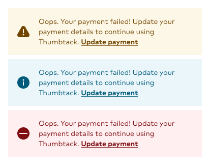
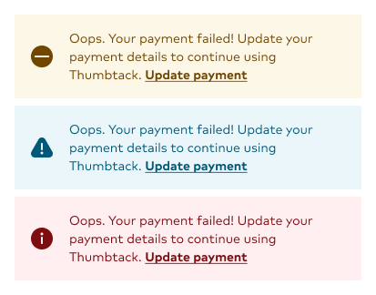
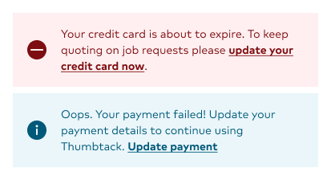
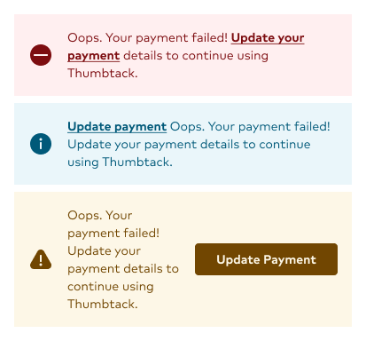

import { graphql } from 'gatsby';
import { Img } from 'components/mdx';
import DoDont from 'components/dodont';
import { Grid, GridColumn } from '@thumbtack/thumbprint-react';
import { ComponentHeader, ComponentFooter } from 'components/thumbprint-components';

<ComponentHeader data={props.data} />

## Usage

The `AlertBanner` should be used to notify the user that a product-related signal is of the utmost importance. These messages will thematically provide informational, cautionary, or warning messages based on the severity and importance level determined by the experience.

To re-enforce the level of importance these messages offer, the AlterBanner should be placed at the top of the page, will not be dismissible, and will disappear once the appropriate action is taken.

## Best practices

`AlertBanner` should be used as a banner at the very top of the page.

Call-to-actions (e.g. `<a>` tags in the `children` prop) should be the last item in the `children`.

You can use the `icon` prop to override the default icon.

<Wrap className="pb4">
    <Grid gutter="wide">
        <GridColumn aboveSmall={6}>
            <DoDont type="do">
                
            </DoDont>
            

                Use icons that appropriately provide the visual accentuation paired with the
                banner's messaging. Also, it's encouraged to use the filled version of the icon when
                available.
            

        </GridColumn>
        <GridColumn aboveSmall={6}>
            <DoDont type="dont">
                
            </DoDont>
            

                Do not use icons that are defaults for the provided themes. For example, avoid using
                an info-filled Icon when using the{' '}
                Caution theme.
            

        </GridColumn>
    </Grid>
</Wrap>
<Wrap className="pb4">
    <Grid gutter="wide">
        <GridColumn aboveSmall={6}>
            <DoDont type="do">
                
            </DoDont>
            

                Place the call-to-action as the last element in the component. These actions are
                clear, concise, and should follow the principles of{' '}
                <a href="/button/usage/#section-copy">Button Copy guidelines</a>.
            

        </GridColumn>
        <GridColumn aboveSmall={6}>
            <DoDont type="dont">
                
            </DoDont>
            

                The call-to-action should not appear before the message, be underlined, bold, and
                should not receive the same as the Button component CTA.
            

        </GridColumn>
    </Grid>
</Wrap>

export const pageQuery = graphql`
    {
        # Get links to by path to display in the navbar.
        platformNav: allSitePage(filter: { path: { glob: "/components/alert-banner/*/" } }) {
            edges {
                node {
                    ...PlatformNavFragment
                }
            }
        }
        # Get package information by NPM package name.
        packageTable: thumbprintComponent(name: { eq: "@thumbtack/thumbprint-react" }) {
            ...PackageTableFragment
        }
        # Get component props by path to component file.
        reactComponentProps: allFile(
            filter: { relativePath: { in: ["thumbprint-react/components/AlertBanner/index.tsx"] } }
        ) {
            ...ReactComponentPropsFragment
        }
    }
`;
