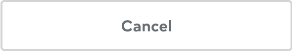
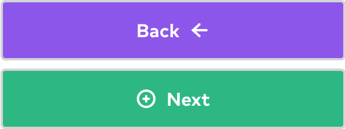

import { graphql } from 'gatsby';
import { Img } from 'components/mdx';
import { Button, TextButton, ButtonRow } from '@thumbtack/thumbprint-react';
import { ContentModifierMessageSmall } from '@thumbtack/thumbprint-icons';
import Alert from 'components/alert';
import { Anatomy, AnatomyItem } from 'components/anatomy';
import DoDont, { DoDontSideBySide } from 'components/dodont';
import UsageImg from 'components/usage-img';
import { InlineCode } from 'components/mdx';
import { ComponentHeader, ComponentFooter } from 'components/thumbprint-components';

<ComponentHeader data={props.data} />

## Usage

The Button (commonly referred to as call-to-actions or CTA) component enables users to perform actions within the page, such as submitting form data or activating sharing utilities. Buttons are also offered in many styles to provide a visual hierarchy of intended use.

<DoDontSideBySide
    headerText={['When to use', 'When not to use']}
    examples={[
        <List>
            <ListItem>Perform actions such as form submissions</ListItem>
            <ListItem>Trigger popup or modal user interface elements </ListItem>
            <ListItem>Change other UI elements such as closing overlays</ListItem>
        </List>,
        <List>
            <ListItem>As links that change the url</ListItem>
        </List>,
    ]}
/>

## Anatomy

<UsageImg>
    
</UsageImg>

<Anatomy>
    <AnatomyItem number="1" title="Surface">
        <Text size={2} className="black-300">
            Colored surface used as backdrop for the Label and Icon (optional) messaging.
        </Text>
    </AnatomyItem>
    <AnatomyItem number="2" title="Label">
        <Text size={2} className="black-300">
            Succinct text that supports a contextual messaging. Text color should match the Icon
            color and should coordinate with the Background hue.
        </Text>
    </AnatomyItem>
    <AnatomyItem number="3" title="Icon / Left">
        <Text size={2} className="black-300">
            Visual support for Label messaging. Most commonly used position. Should not be used in
            conjunction with Icon / Right.
        </Text>
    </AnatomyItem>
    <AnatomyItem number="3" title="Icon / Right">
        <Text size={2} className="black-300">
            Visual support for Label messaging. Typically used a directional indicator. Should not
            be used in conjunction with Icon / Left.
        </Text>
    </AnatomyItem>
</Anatomy>

## Specs

Component details and standards such as spacing, sizing, and color.

### Spacing

There are two button sizes, Large and Small. Almost always, the Large size should be used. Tertiary buttons should mostly be used in the Small size, and Tertiary may not be used at the Large size.

#### Large

<UsageImg>
    

        
        
    

</UsageImg>
<Text size={2} className="black-300">
    The height of the component will be fixed at 48px/pts. Large buttons can optional be full-width
    and take up 100% of the container’s width.
</Text>
<Text size={2} className="black-300">
    Most commonly used for mobile, full-width buttons may only use the Primary & Tertiary styles.
    They can’t be in a container over 480px wide and can’t be smaller than 300px. They also should
    only be used on white backgrounds. Padding is set to 24px around the button
</Text>

#### Small

<UsageImg>
    
</UsageImg>
<Text size={2} className="black-300">
    The height of the component will be fixed at 32px/pts. Small buttons should not span 100% width
    of the viewport and will always hug the contents of the component.
</Text>

### Sizing

<UsageImg>
    
</UsageImg>
<Text size={2} className="black-300">
    Text should follow the Title size 6 that translates to 16px bold. Icons should apply the Small
    size.
</Text>

### Color

Buttons are offered in four variations: Primary, Secondary, Tertiary and Caution. Each variation includes a set color scheme that provides the appropriate emphasis based on the intended use case.

#### Primary

<UsageImg>
    
</UsageImg>
<Text size={2} className="black-300">
    Use the Primary variation to build the strongest emphasis for CTAs.
</Text>

#### Secondary

<UsageImg>
    
</UsageImg>
<Text size={2} className="black-300">
    Secondary CTAs should be used as an alternative to a Primary variation when dialing back the
    need to call the user’s attention.
</Text>
<Text size={2} className="black-300">
    These actions can both live in independent of and can also be paired with a Primary CTA.
</Text>

#### Tertiary

<UsageImg>
    
</UsageImg>
<Text size={2} className="black-300">
    When three actions are used in the same space, the tertiary should be used in the last position
    to pull back the visual attraction given to the Primary and Secondary CTA.
</Text>
<Text size={2} className="black-300">
    In certain circumstances, the Tertiary variation can be used independently of the Primary and
    Secondary, but these instances should be used sparingly.
</Text>

#### Caution

<UsageImg>
    
</UsageImg>
<Text size={2} className="black-300">
    The Caution variation should be used to signal to the user that their action can potentially
    lead to a dangerous or destructive circumstance.
</Text>
<Text size={2} className="black-300">
    The positioning of this action should be determined by the how destructive this moment could be
    the UX.
</Text>

#### Solid

<UsageImg>
    
</UsageImg>
<Text size={2} className="black-300">
    Most commonly these buttons may only be used on top of a “Base Color” such as blue or indigo or
    on top of a photo. Solid CTAs can also be used to reduce the visual weight introduced but other
    button variations.
</Text>

## Best practices

Below is a list of examples of how CTAs should/shouldn't be used through visual representations of our Do's and Dont's.

<DoDontSideBySide
    description={[
        'Place the Primary CTA in the top position when buttons are stacked vertically.',
        'Place the Primary CTA under any other CTA option.',
    ]}
    examples={[
        

            
        
,
        

            
        
,
    ]}
/>

<DoDontSideBySide
    description={[
        'Use iconography provided by Thumbprint for the left / right icons.',
        'Do not use external images, iconography, or emojis.',
    ]}
    examples={[
        

            
        
,
        

            
        
,
    ]}
/>

<DoDontSideBySide
    description={[
        'Use icons intentionally and responsibly. Icons should provide immediate and relative support to the experience.',
        'Use iconography that can be misleading or does not provide additional context.',
    ]}
    examples={[
        

            
        
,
        

            
        
,
    ]}
/>

<DoDontSideBySide
    description={[
        'Use the spacing and sizing provided by the component.',
        'Make sizing adjustments for buttons to fit particular circumstances.',
    ]}
    examples={[
        

            
        
,
        

            
        
,
    ]}
/>

<DoDontSideBySide
    description={[
        'Use colors provided by the variant options determined by the button theme.',
        'Adjust CTA colors to fit a particular context.',
    ]}
    examples={[
        

            
        
,
        

            
        
,
    ]}
/>

## Accessibility

-   Be sure text has a contrast ratio of at least 4.5:1 for small text and at least - 3:1 for large text (WCAG 2.0 1.4.3)
-   Color should not be used exclusively to convey information
-   Text sizes should be scalable
-   Buttons should be accessible via keyboard interactions
-   Image-only buttons and links need alt-text
-   Use buttons for primary actions and links for navigation

## Content design

-   Buttons should be 4 words or less
-   Write in sentence case, except for proper nouns (like the Thumbtack Guarantee)
-   Do not use punctuation
-   Provide alt text for image-only buttons

Learn more about writing for buttons, CTAs, and links in [Surfaces and Elements](/overview/content-design/surfaces-and-elements/#section-calls-to-action).

## Related components

-   **[Button Row](/components/button-row/react/)** - Consistent spacing between buttons
-   **[Link](/components/link/react/)** - Color and style variations for anchor links
-   **[FAB](/components/fab/react/)** - Buttons providing easy access to important actions
-   **[Chip](/components/chip/react)** - Compact controls that allow for toggling and filtering

export const pageQuery = graphql`
    {
        # Get links to by path to display in the navbar.
        platformNav: allSitePage(filter: { path: { glob: "/components/button/*/" } }) {
            edges {
                node {
                    ...PlatformNavFragment
                }
            }
        }
    }
`;
