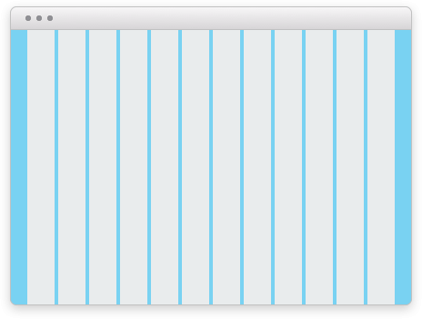
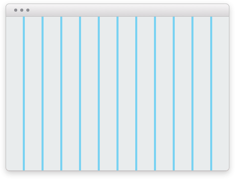

import { graphql } from 'gatsby';
import { ComponentHeader, ComponentFooter } from 'components/thumbprint-components';
import { tpSpace5, tpSpace3, tpWrapMaxWidth } from '@thumbtack/thumbprint-tokens';
import { Img, InlineCode } from 'components/mdx';
import { Grid, GridColumn, Text } from '@thumbtack/thumbprint-react';

<ComponentHeader data={props.data} />

## 12-column

The grid system is foundation for most page-level layouts.

-   The grid can contain any number of columns divisable by 12.
-   The gutter between columns defaults to <InlineCode children={tpSpace3} /> with options for <InlineCode children={tpSpace5} /> gutter or no gutter.
-   Columns inside the grid can adjust their width at any breakpoint.

## Variations

1.  Grids are almost always used with a wrapper, as in Figure 1. Using the [Wrap](/components/wrap/usage/) component the grid has a max-width of <InlineCode children={tpWrapMaxWidth} /> and is centered.
2.  Without the wrap the grid will run the full width of the viewport, shown in Figure 2.

<Grid>
    <GridColumn aboveSmall={6}>
        
        <Text size={3} className="black-300 ml2 relative -top-5">
            Figure 1
        </Text>
    </GridColumn>
    <GridColumn aboveSmall={6}>
        
        <Text size={3} className="black-300 ml2 relative -top-5">
            Figure 2
        </Text>
    </GridColumn>
</Grid>

## Responsive

By default grid columns will stack. The widths of the grid columns can be changed at each breakpoint.

<Grid>
    <GridColumn aboveSmall={4}>
        

    </GridColumn>
    <GridColumn aboveSmall={4}>
        

    </GridColumn>
    <GridColumn aboveSmall={4}>
        

    </GridColumn>
</Grid>

## Multi-row wrapping

Columns can also used to create more complicated layouts. Below are three columns that change width and wrap according to values specified for each breakpoint.

-   By default all columns are stacked.
-   Above the "small" breakpoint the first column spans the last two, which are side-by-side.
-   Above the "medium" breakpoint all columns are in one row with the first at `50%` width and the remaining columns `25%` each.

<Grid>
    <GridColumn aboveSmall={12} aboveMedium={6}>
        

    </GridColumn>
    <GridColumn aboveSmall={6} aboveMedium={3}>
        

    </GridColumn>
    <GridColumn aboveSmall={6} aboveMedium={3}>
        

    </GridColumn>
</Grid>

<ComponentFooter data={props.data} />

export const pageQuery = graphql`
    {
        # Get links to by path to display in the navbar.
        platformNav: allSitePage(filter: { path: { glob: "/components/grid/*/" } }) {
            edges {
                node {
                    ...PlatformNavFragment
                }
            }
        }
    }
`;
