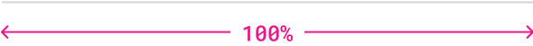

import { graphql } from 'gatsby';
import { Img } from 'components/mdx';
import DoDont, { DoDontSideBySide } from 'components/dodont';
import Badge from 'components/badge';
import UsageImg from 'components/usage-img';
import { Anatomy, AnatomyItem } from 'components/anatomy';
import {
    Grid,
    GridColumn,
    List,
    ListItem,
    Title,
    Text,
    HorizontalRule,
} from '@thumbtack/thumbprint-react';
import { ComponentHeader, ComponentFooter } from 'components/thumbprint-components';

<ComponentHeader data={props.data} />

## Usage

Intended to serve as a visual separate between visual elements. Visual elements can be any variety of content types including but not excluded to text, imagery, cards, or any additional regions that can benefit the experience through separation.

<DoDontSideBySide
    headerText={['When to use', 'When not to use']}
    examples={[
        <List>
            <ListItem>Visually separate sub regions of text</ListItem>
            <ListItem>Seperate elements with no border or container</ListItem>
        </List>,
        <List>
            <ListItem>Adjacent borders are present</ListItem>
            <ListItem>Separating headings and text</ListItem>
        </List>,
    ]}
/>

## Anatomy

<UsageImg>
    
</UsageImg>

<Anatomy>
    <AnatomyItem number="1" title="Line">
        <Text size={2} className="black-300">
            Solid, dotted, or dashed colored visual separator between blocks of visual elements.
        </Text>
    </AnatomyItem>
</Anatomy>

## Specs

Component details and standards such as spacing, sizing, and color.

### Spacing

<UsageImg>
    
</UsageImg>
<Text size={2} className="black-300">
    The rule should occupy 100% width of the containing element.
</Text>

### Sizing

<UsageImg>
    
</UsageImg>
<Text size={2} className="black-300">
    The height of the component will be fixed at 1px/pts.
</Text>

### Color

<UsageImg>
    
</UsageImg>
<Text size={2} className="black-300">
    Controls the color of the line rendered for the horizontal rule. Use **gray** text or
    **gray-300** as fill colors
</Text>

## Best practices

This component should be used to build a visual separation between two visual element that would otherwise be difficult to distinguish from one another.

It should not be paired with other components, sections, or areas of content that are already separated via borders.

The solid variation should be considered the default behavior. To soften the level of separation, the dashed or dotted approach can be used.

<DoDontSideBySide
    description={[
        'Use to provide strengthen visual separation between blocks of text.',
        "Don't description",
    ]}
    examples={[
        

            
        
,
        

            
        
,
    ]}
/>

<DoDontSideBySide
    description={[
        'Opt for the background variation that provides the most subtle level of separation. For example, use the gray-300 option on a white background.',
        'Avoid variations that introduce stark levels of contrast between the component and it’s background placement.',
    ]}
    examples={[
        

            
        
,
        

            
        
,
    ]}
/>

## Accessibility

-   Exclude from the display of assistive technologies

export const pageQuery = graphql`
    {
        # Get links to by path to display in the navbar.
        platformNav: allSitePage(filter: { path: { glob: "/components/horizontal-rule/*/" } }) {
            edges {
                node {
                    ...PlatformNavFragment
                }
            }
        }
        # Get package information by NPM package name.
        packageTable: thumbprintComponent(name: { eq: "@thumbtack/thumbprint-react" }) {
            ...PackageTableFragment
        }
        # Get component props by path to component file.
        reactComponentProps: allFile(
            filter: {
                relativePath: { in: ["thumbprint-react/components/HorizontalRule/index.tsx"] }
            }
        ) {
            ...ReactComponentPropsFragment
        }
    }
`;
