import { graphql } from 'gatsby';
import { ComponentHeader, ComponentFooter } from 'components/thumbprint-components';
import { Img } from 'components/mdx';
import DoDont from 'components/dodont';
import Alert from 'components/alert';
import { Grid, GridColumn } from '@thumbtack/thumbprint-react';

<ComponentHeader data={props.data} />

Modal dialogs appear as an overlay on a page. They should be used when Thumbtack requires a user response or needs to explain critical information without losing context of the page beneath it.

## Best practices

<Grid gutter="wide">
    <GridColumn aboveSmall={6}>
        <DoDont type="do">
            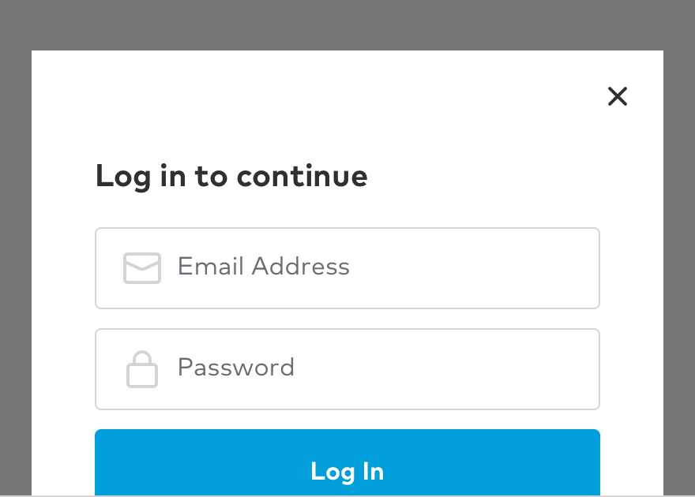
        </DoDont>
    </GridColumn>
    <GridColumn aboveSmall={6}>
        <DoDont type="dont">
            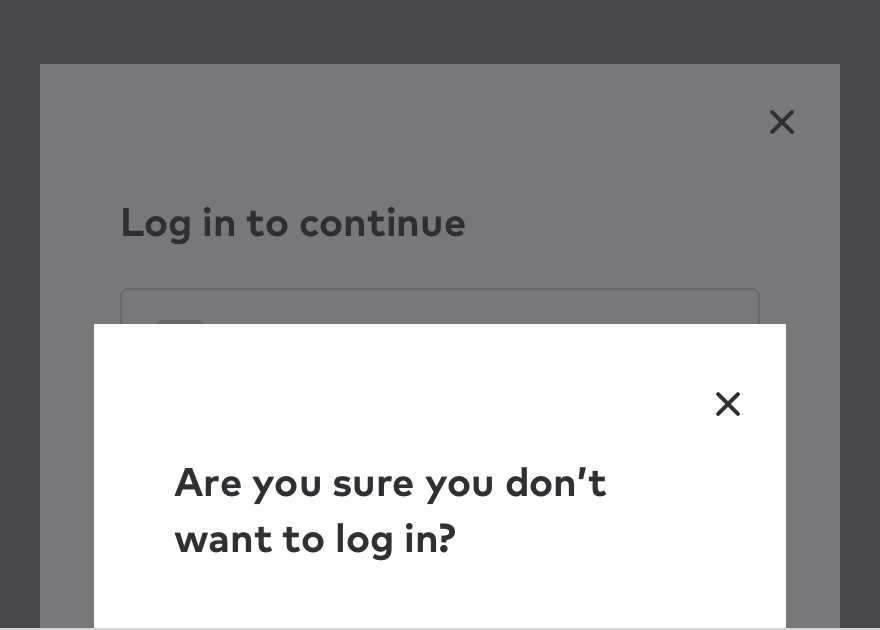
        </DoDont>
    </GridColumn>
</Grid>

<Grid gutter="wide">
    <GridColumn aboveSmall={6}>
        
When to use

        

            Use when you want a user to confirm an important action or to get information like
            signing up or logging in. Since modals do interrupt a users’ experience, they could be
            perceived as annoying or bothersome and should be used with discretion.
        

    </GridColumn>
    <GridColumn aboveSmall={6}>
        
When not to use

        

            Do not use a modal without a trigger from the user, for example on page load. Also, do
            not use if there is a modal already being displayed.
        

    </GridColumn>
</Grid>

<Alert type="note" title="Tip" className="mt5">
    If you need a follow up modal, the original container will stay on the page, and the content
    will replace itself.
</Alert>

### Writing for modals

Context is key. There needs to be a direct connection between the trigger (i.e. a button or link) and the modal that follows. This can be achieved by directly repeating the words of the trigger or using related terms. Maintaining a sense of connection between the CTA and modal transition is important to keep and maintain a consistent user experience.

<Grid gutter="wide">
    <GridColumn aboveSmall={6}>
        
Trigger

        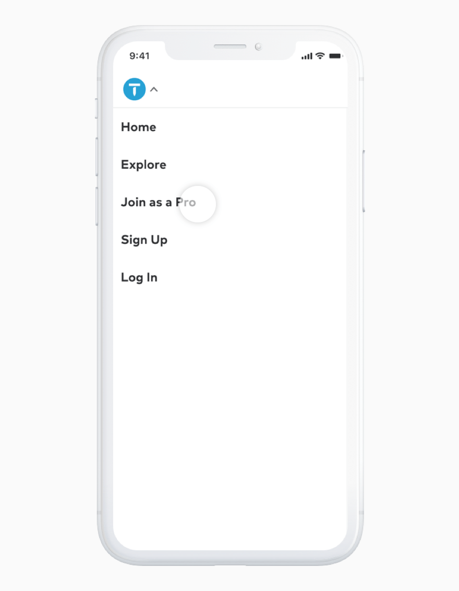
    </GridColumn>
    <GridColumn aboveSmall={6}>
        
Resulting modal

        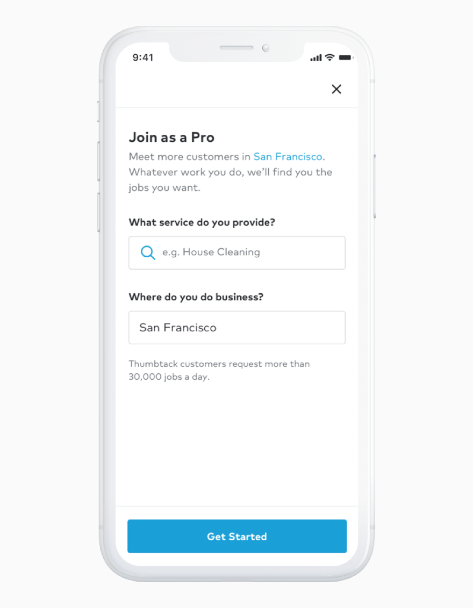
    </GridColumn>
</Grid>

<Alert type="note" title="Tip" className="mt5">
    Be concise. By doing this, the user can make a decision and get back to the original task.
</Alert>

### Behavior

#### Arrival

How modals arrive is just as important as the content they contain. Animation does more than provide a visually pleasing experience. They indicate to the user that there is something on top of the content they are interacting with.

#### Dismissing

By default, modals can be closed by clicking on the “x” in the upper right hand corner of the container or by clicking anywhere outside of the container which is called the “curtain”. The animation of the arrival is used, just in reverse.

#### Autofocus

By default, the focus is placed on the first item a user can select, allowing them to quickly select the requested information, or submit the modal.

## Default Modal

The default modal allows users to interact with and ultimately alter the experience it is currently interrupting. If you find that the number of required elements for your design is making the dialog convoluted, then try a different design solution.

    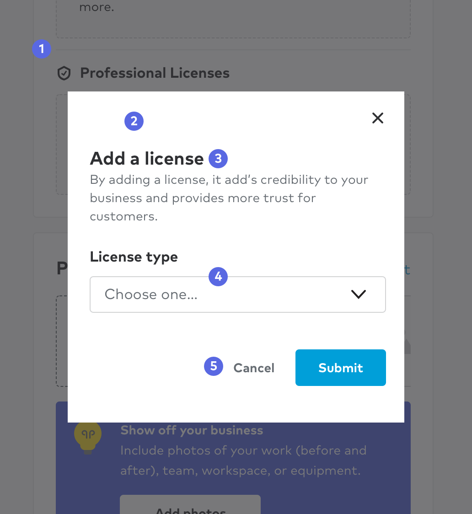

### Anatomy

#### 1. Curtain

Covers the underlying content while providing focus to the information being served in the container. Note that there is no curtain below the small breakpoint.

#### 2. Container

As implied, this is where the contents of the modal dialogue such as text, inputs, buttons, and illustrations are held.

#### 3. Title

Reinforces context from the initial trigger on page while providing an overview of the modal.

#### 4. Content

A concise description or simple action a user must address. If multiple steps are required, use a whole page instead.

#### 5 Action bar

Contains the primary action of the modal. All modals must have a primary CTA, and can support secondary CTA's as well. These actions should speak to and reinforce completing the action they are being asked to complete.

<Grid gutter="wide">
    <GridColumn aboveSmall={6}>
        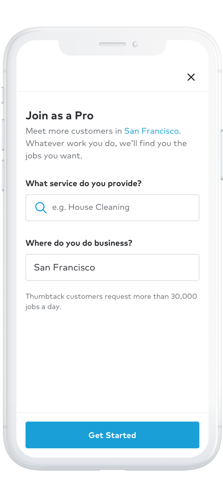
    </GridColumn>
    <GridColumn aboveSmall={6}>
        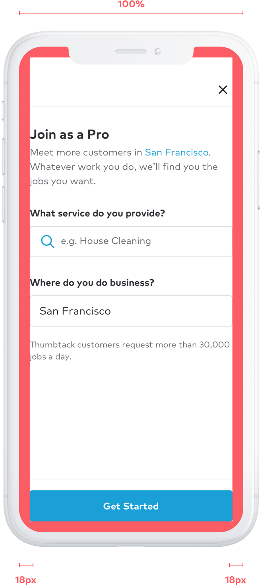
    </GridColumn>
</Grid>

### Sizes

#### Small breakpoint

Unlike the other modal sizes, the small size is a full screen experience with no curtain. This gives us more space to use and ultimately provide a a better user experience.

#### Transition

Our website relies on white space to separate content and provide direction for users. With no curtain to separate the modal from the background content, we rely on transitions to reinforce page hierarchy. Our modal on small slides up from the bottom to tell the user that the original content is beneath.

#### Options

Button can be sticky at the bottom or scroll with modal content.

#### Medium & Large breakpoints

There are two modal sizes; narrow and wide. Each take up a percentage of screen real estate and are responsive to the browser width. You will find two separate symbols in Sketch for the medium & large artboards.

<Grid gutter="wide">
    <GridColumn aboveSmall={6}>
        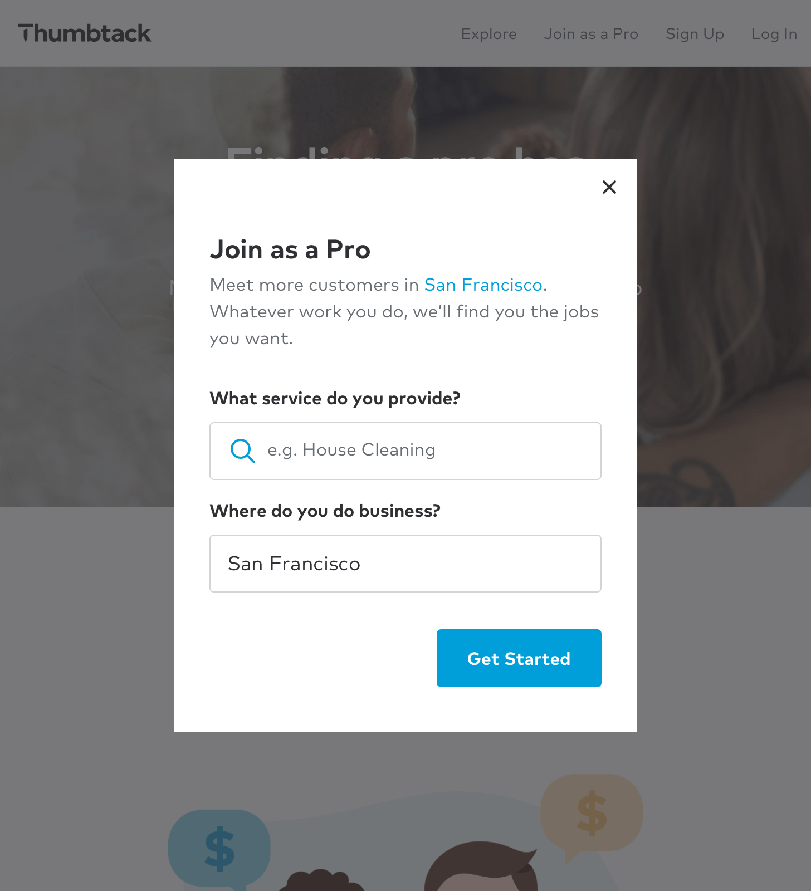
    </GridColumn>
    <GridColumn aboveSmall={6}>
        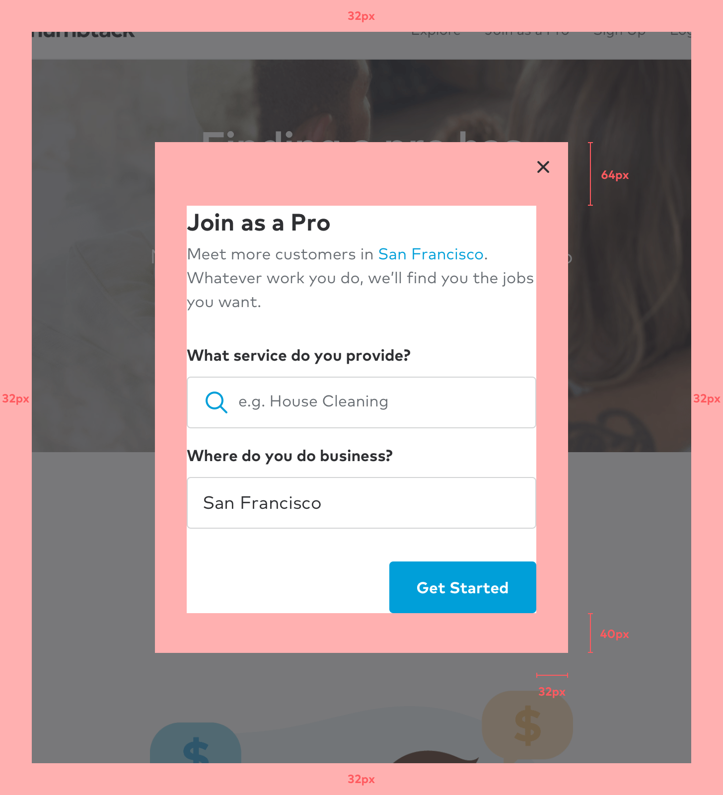
    </GridColumn>
</Grid>

&nbsp;

<Grid gutter="wide">
    <GridColumn aboveSmall={6}>
        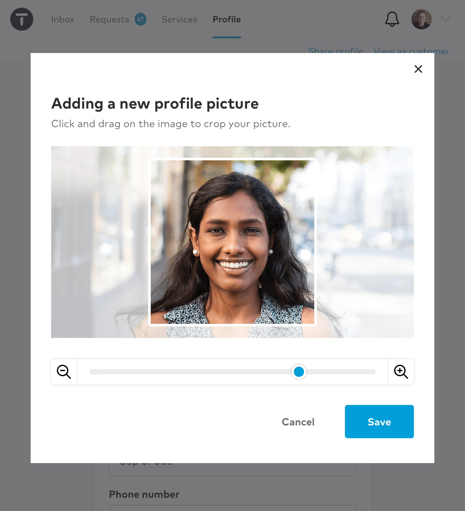
    </GridColumn>
    <GridColumn aboveSmall={6}>
        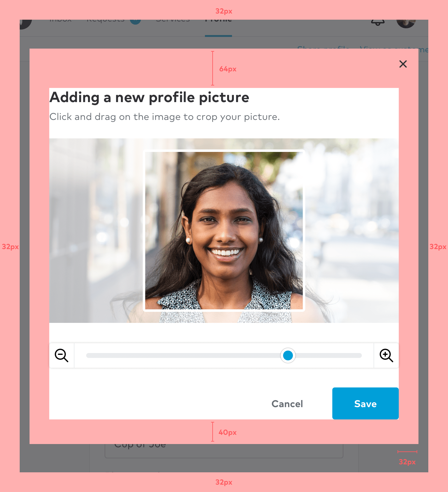
    </GridColumn>
</Grid>

#### Properties

A modal's height will grow to fit their content up to 50% of the screen's height. Beyond that, the content will scroll with in the modal.

## Announcement modal

These modals are for important announcements. They are best used as an entry point to focus all of the user's attention on a large or impactful update on the platform. They can also be followed by a series of popovers to highlight individual changes and benefits.

    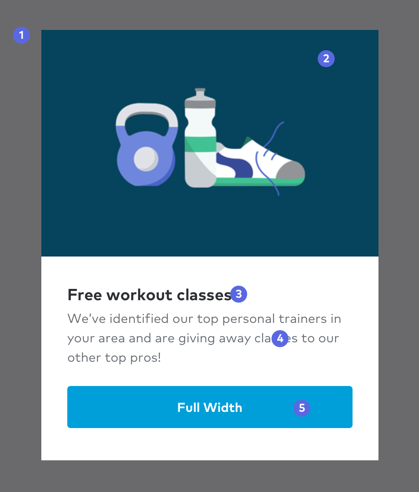

### Anatomy

#### 1. Curtain

Covers the underlying content while providing focus to the information being served in the container. Note that there is no curtain below the small breakpoint.

#### 2. Illustration

Should always reinforce the message we are trying to communicate in the modal.

#### 3. Title

Reinforces context from the initial trigger on page while providing an overview of the modal.

#### 4. Contents

A concise description or simple action a user must address. If multiple steps are required, use a whole page instead.

#### 5. Action bar

Contains the primary action of the modal. Since it is the primary action, use the primary button. These actions should also contain hint text to provide even further context.

<ComponentFooter data={props.data} />

export const pageQuery = graphql`
    {
        # Get links to by path to display in the navbar.
        platformNav: allSitePage(filter: { path: { glob: "/components/modal-default/*/" } }) {
            edges {
                node {
                    ...PlatformNavFragment
                }
            }
        }
    }
`;
