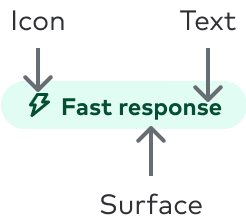
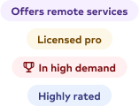
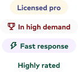
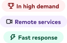
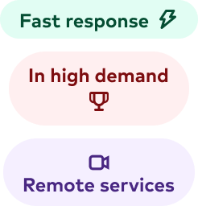

import { graphql } from 'gatsby';
import { Img } from 'components/mdx';
import DoDont from 'components/dodont';
import { Grid, GridColumn } from '@thumbtack/thumbprint-react';
import { ComponentHeader, ComponentFooter } from 'components/thumbprint-components';

<ComponentHeader data={props.data} />

## Usage

Used for quick visual recognition of user interface elements in a clear, concise, and contextual manner.

`Pill`s are also considered read-only and are non-interactive in nature. See [Chip](/components/chip) component for an interactive element with with similar characteristics.

## Anatomy

    

        
    

## Best practices

Ideally, messaging will be kept to 1-2 words. When necessary, it’s possible to use three words to convey the message, but this length should be avoided when possible, and this will be considered the max length allowed.

You can use the icon parameter to provide additional accentuation in the messaging.

<Wrap className="pb4">
    <Grid gutter="wide">
        <GridColumn aboveSmall={6}>
            <DoDont type="do">
                

                    
                

            </DoDont>
            

                Use 600-level text & 100-level surface colors of the same hue.
            

        </GridColumn>
        <GridColumn aboveSmall={6}>
            <DoDont type="dont">
                

                    
                

            </DoDont>
            

                Mix and match color values with surface and text colors. Avoid using white as a
                surface color.
            

        </GridColumn>
    </Grid>
</Wrap>
<Wrap className="pb4">
    <Grid gutter="wide">
        <GridColumn aboveSmall={6}>
            <DoDont type="do">
                

                    
                

            </DoDont>
            

                When including iconography, place the icon on the left-hand side of the text.
            

        </GridColumn>
        <GridColumn aboveSmall={6}>
            <DoDont type="dont">
                

                    
                
    
            </DoDont>
            

                Place the icon on any location other than the left side of the pill.
            

        </GridColumn>
    </Grid>

</Wrap>

## Accessibility

-   Color contrast ratios should pass the standards for WCAG AA 2.1 compliance.
-   Avoid using color alone to express the intention of the messaging.
-   The icon should be considered as strictly presentational and hidden from screen readers unless otherwise explicitly expressed.

## Related components

-   [Icons](https://thumbprint.thumbtack.io/icons)
-   [Chip](/components/chip)

export const pageQuery = graphql`
    {
        # Get links to by path to display in the navbar.
        platformNav: allSitePage(filter: { path: { glob: "/components/pill/*/" } }) {
            edges {
                node {
                    ...PlatformNavFragment
                }
            }
        }
        # Get package information by NPM package name.
        packageTable: thumbprintComponent(name: { eq: "@thumbtack/thumbprint-react" }) {
            ...PackageTableFragment
        }
        # Get component props by path to component file.
        reactComponentProps: allFile(
            filter: { relativePath: { in: ["thumbprint-react/components/Pill/index.tsx"] } }
        ) {
            ...ReactComponentPropsFragment
        }
    }
`;
