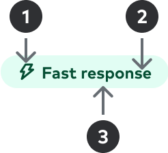
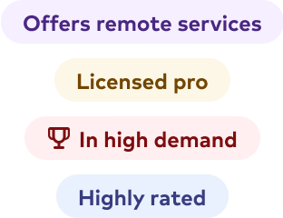
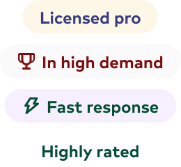
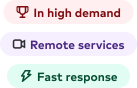

import { graphql } from 'gatsby';
import { Img } from 'components/mdx';
import DoDont from 'components/dodont';
import Badge from 'components/badge';
import UsageImg from 'components/usage-img';
import { Anatomy, AnatomyItem } from 'components/anatomy';
import { Grid, GridColumn, Text } from '@thumbtack/thumbprint-react';
import { ComponentHeader, ComponentFooter } from 'components/thumbprint-components';

<ComponentHeader data={props.data} />

## Usage

Used for quick visual recognition of user interface elements in a clear, concise, and contextual manner.

`Pill`s are also considered read-only and are non-interactive in nature. See [Chip](/components/chip) component for an interactive element with with similar characteristics.

## Anatomy

<UsageImg>
    
</UsageImg>

<Anatomy>
    <AnatomyItem number="1" title="Icon">
        <Text size={2} className="black-300">
            Accentuates messaging through visual reprentation selected from the icon library. The
            fill color should match the Text color and coordinate with
            the Background hue.
        </Text>
    </AnatomyItem>
    <AnatomyItem number="2" title="Text">
        <Text size={2} className="black-300">
            Succinct messaging (1-2) that supports a contextual messaging. Color should match the{' '}
            Icon color and should coordinate with the
             Background hue.
        </Text>
    </AnatomyItem>
    <AnatomyItem number="3" title="Color">
        <Text size={2} className="black-300">
            Colored surface used as backdrop for the Text and{' '}
            Icon (optional) messaging.
        </Text>
    </AnatomyItem>
</Anatomy>

## Specs

Component details and standards such as spacing, sizing, and color.

### Spacing

<UsageImg>
    
</UsageImg>
<Text size={2} className="black-300">
    The height of the component will be fixed at 24px/pts. Exterior spacing will 12px/pts and
    4px/pts should be used to separe the Icon and Text (when applicable).
</Text>

### Sizing

<UsageImg>
    
</UsageImg>
<Text size={2} className="black-300">
    Text should follow the Title size 8 that translates to 12px bold. Icons should apply the Tiny
    size.
</Text>

### Color

<UsageImg>
    
</UsageImg>
<Text size={2} className="black-300">
    Use 600-level text & 100-level surface colors of the same hue.
</Text>

## Best practices

Ideally, messaging will be kept to 1-2 words. When necessary, it’s possible to use three words to convey the message, but this length should be avoided when possible, and this will be considered the max length allowed.

You can use the icon parameter to provide additional accentuation in the messaging.

<Wrap className="pb4">
    <Grid gutter="wide">
        <GridColumn aboveSmall={6}>
            <DoDont type="do">
                
            </DoDont>
            

                Use 600-level text & 100-level surface colors of the same hue.
            

        </GridColumn>
        <GridColumn aboveSmall={6}>
            <DoDont type="dont">
                
            </DoDont>
            

                Mix and match color values with surface and text colors. Avoid using white as a
                surface color.
            

        </GridColumn>
    </Grid>

</Wrap>
<Wrap className="pb4">
    <Grid gutter="wide">
        <GridColumn aboveSmall={6}>
            <DoDont type="do">
                
            </DoDont>
            

                When including iconography, place the icon on the left-hand side of the text.
            

        </GridColumn>
        <GridColumn aboveSmall={6}>
            <DoDont type="dont">
                
            </DoDont>
            

                Place the icon on any location other than the left side of the pill.
            

        </GridColumn>
    </Grid>

</Wrap>

## Accessibility

-   Color contrast ratios should pass the standards for WCAG AA 2.1 compliance.
-   Avoid using color alone to express the intention of the messaging.
-   The icon should be considered as strictly presentational and hidden from screen readers unless otherwise explicitly expressed.

## Related components

-   **[Chip](/components/chip)** - Compact controls that allow for toggling and filtering
-   **[Icons](https://thumbprint.thumbtack.io/icons)** - Assets for multiple platforms.

export const pageQuery = graphql`
    {
        # Get links to by path to display in the navbar.
        platformNav: allSitePage(filter: { path: { glob: "/components/pill/*/" } }) {
            edges {
                node {
                    ...PlatformNavFragment
                }
            }
        }
        # Get package information by NPM package name.
        packageTable: thumbprintComponent(name: { eq: "@thumbtack/thumbprint-react" }) {
            ...PackageTableFragment
        }
        # Get component props by path to component file.
        reactComponentProps: allFile(
            filter: { relativePath: { in: ["thumbprint-react/components/Pill/index.tsx"] } }
        ) {
            ...ReactComponentPropsFragment
        }
    }
`;
