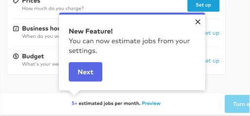
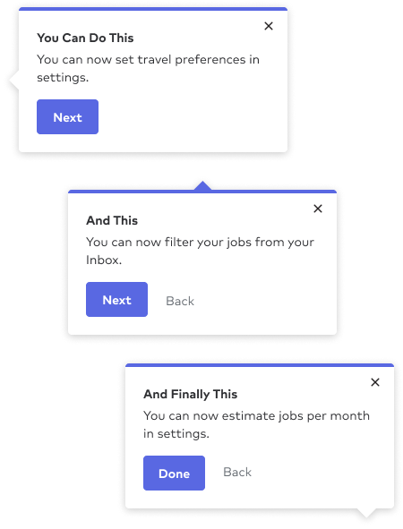
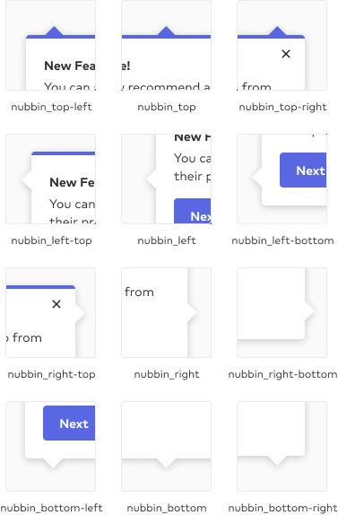
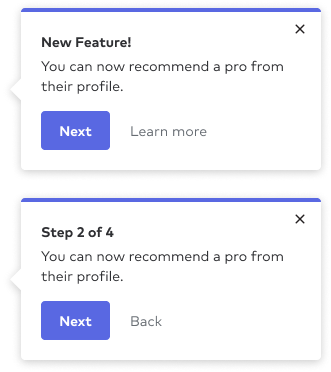

import { graphql } from 'gatsby';
import { ComponentHeader, ComponentFooter } from 'components/thumbprint-components';
import { Img } from 'components/mdx';

<ComponentHeader data={props.data} />

## Default

The default popover contains a header, a text description, and a button. This popover can exist on its own or in a series of popovers.

Note: If the popover is a part of a series, the CTA copy should reflect this by saying something along the lines of “Next” and “Done” to indicate progress in the series.

## As a series

Popovers are best used for tutorials and walkthroughs and thus need to be strung together as a series of tips.
To best achieve this, make sure the developer is aware of the steps in the flow, and write content that makes it clear that there is a progression in the series.

If a back button is needed, use the link variant to include a back button for the series.

## Behaviour and Nubbin Positioning

Popovers are triggered during onboarding, any first time user experience, or an announcement of a new feature.
The nubbin of the popover should be positioned to point to the feature/area the popover is referencing for best context.

The nubbin can be placed at the start, middle, or end of each of the 4 sides of the popover.

## Variants

Popovers can contain a link next to the button to link to more information or to provide the user with a back affordance for series of popovers.

<ComponentFooter data={props.data} />

export const pageQuery = graphql`
    {
        # Get links to by path to display in the navbar.
        platformNav: allSitePage(filter: { path: { glob: "/components/popover/*/" } }) {
            edges {
                node {
                    ...PlatformNavFragment
                }
            }
        }
    }
`;
