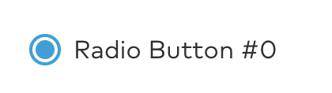
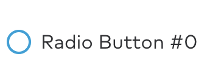

import { graphql } from 'gatsby';
import { ComponentHeader, ComponentFooter } from 'components/thumbprint-components';

<ComponentHeader data={props.data} />

## Summary

Control for selecting an option inside a form.



## Accessibility

Set `adjustsFontForContentSizeCategory: true` (the default) to enable Dynamic Type support for a Radio.

## Public API

### Radio

#### `class Radio: Control, SimpleControl`

Represents only the round button part of the control. Except for very custom UI shouldn't see direct use.

Some of its basic control API is in common with LabeledRadio.

### LabeledRadio

#### `class LabeledRadio, Control, SimpleControl`

The full radio control with a label. Can be customized with a more complex content view but needs to always have a label set as its main, which will reflect its disabled state etc.

#### Full Initializer

```
public init(
    control: Radio = Radio(),
    label: UILabel,
    content: (UIView & UIContentSizeCategoryAdjusting)? = nil,
    adjustsFontForContentSizeCategory: Bool = true
)
```

Custom initializer, use when you need something more complex than a standard radio control with a simple label next to it.

-   control: Pass in a custom `Radio` if needed, should be very rarely used.
-   label: The reference label. The radio will be vertically aligned against the center of label's first line. It will also reflect the radio state.
-   content: Optionally, a view to use as the radio's content. If not nil, `label` must be a part of it.
-   adjustsFontForContentSizeCategory: Pass in `false` if the UI where it will be displayed doesn't support dynamic font sizes.

#### `public convenience init(text: String? = nil, adjustsFontForContentSizeCategory: Bool = true)`

Convenience initializer for the standard radio button theme. The label will be set to a simple `Label` with `.text1` theme.

#### `public var text: String?`

Convenience access to the label's text

#### `public var attributedText: NSAttributedString?`

Allows for setting formatted text of the labeled radio's label. Keep in mind that Thumbprint theming will mostly be ignored if this is set.

#### `public enum LabeledControl.ContentPlacement: CaseIterable { case leading case trailing }`

Available values for the `contentPlacement` property.

#### `public var contentPlacement`

Determines on which side of the labeled radio will the label and other content layout.


#### `public var numberOfLines: Int`

Convenience access to the label's property of the same name. For behavior, look the documentation for `UILabel.numberOfLines`

#### `public var contentInsets: NSDirectionalEdgeInsets`

Allows for larger margins around the labeled radio contents. The additional area will also register touches.

#### `public let label: UILabel`

Direct read-only access to the labeled radio's label. Usually it will be a `Thumbprint.Label` control but if initialized with custom content it may be a `UILabel` or a different subclass of it.

#### `public func labelLayoutDidChange()`

If the labeled radio's formatting is modified you should always call this method, it will ensure that the radio button is correctly aligned against it.

#### `public var isSelected: Bool`

Manages selected state



#### `public var isEnabled: Bool`

Manages enabled state


## Usage

The `Radio` class manages only the graphical radio button itself. The full control with a label (or several) that should be generally used is `LabeledRadio`. The public API described above works for both classes other than `contentPosition` which is specific to LabeledControl.

Radio buttons should generally be used within a `RadioGroup` to control exclusive selection. Components such as `RadioStack` already set up the radio group for you and should be used wherever possible. To receive updates when the user selects a different radio button, subscribe to `RadioGroup.selection`.

### Example

```swift
import Combine

/* ... */

let titles = ["Apple", "Banana", "Orange"]
let radioStack = RadioStack(titles: titles, adjustsFontForContentSizeCategory: adjustsFontForContentSizeCategory)
radioStack.delegate = self
view.addSubview(radioStack)

/* ... */

radioStack.radioGroup.selection
    .receive(on: RunLoop.main)
    .sink { [weak self] selection in
        self?.radioStackDidSelectRadioAt(index: selection)
    }
    .store(in: &subscriptions)

```

export const pageQuery = graphql`
    {
        # Get links to by path to display in the navbar.
        platformNav: allSitePage(filter: { path: { glob: "/components/radio/*/" } }) {
            edges {
                node {
                    ...PlatformNavFragment
                }
            }
        }
    }
`;
