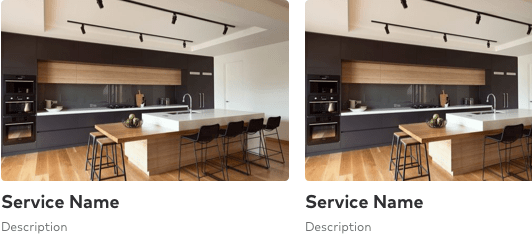
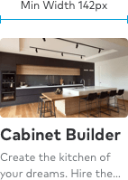
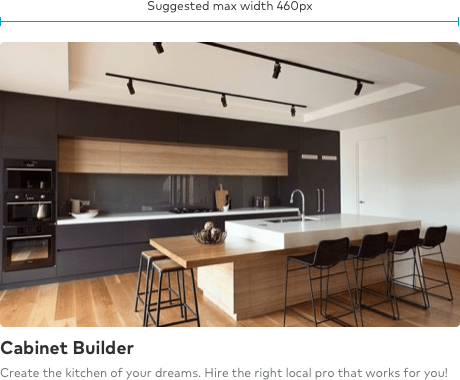
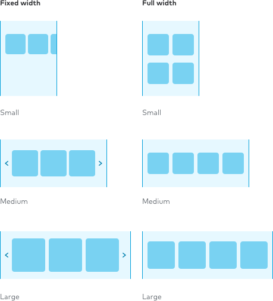
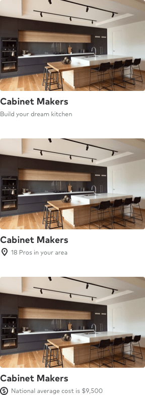

import { graphql } from 'gatsby';
import { ComponentHeader, ComponentFooter } from 'components/thumbprint-components';
import { Img } from 'components/mdx';
import Alert from 'components/alert';

<ComponentHeader data={props.data} />

Service cards act as a gateway for users starting their first project. They provide an exploratory experience, revealing the depth and breadth of our product. They cannot stand alone and are used in groups or “decks”.

## Types

In its most basic form, a Service card is an image with an 8:5 aspect ratio, a title, and description beneath it with an optional icon.

For optimum legibility, card decks should be presented on a white background.

## Sizes &amp; truncation

The minimum width of a service card is 142px. Ideally, the card should never be larger than 460px. This ensures legibility on the smallest screens while not taking over the page on the larger screens.

<Alert type="note" title="Tip" className="mt5">
    It's a best practice to have roughly 36 characters or fewer for titles and descriptions. Each
    supports text wrapping up to two lines. Titles will truncate at two lines.
</Alert>

    

        
    

    

        
    

## Responsive options

Service cards are designed to fit anywhere. To make that happen we support two different page responsive wrapper types: fixed width (snap), and full width (fluid).

<Alert type="note" title="Tip" className="mt5">
    When using full width card decks, it’s best to use an even number of cards to prevent orphan
    cards in a layout.
</Alert>

## Supportive information

Supportive information helps set context for the user’s next experience. Information such as price, number of Pros, average star rating, and icons are examples of what can be shown to orient the user.

To minimize cognitive load, decks of cards should only contain similar card types. For example, cards with cost information should only be grouped with other cost cards.

They also link exclusively to the pages associated to the information type. Cards with price information should link to cost pages; cards with number of local pros should link to “Near me” pages.

<Alert type="note" title="Suggestion" className="mt5">
    To introduce a deck of cards with differing supporting information, there should be a break in
    content to separate ideas.
</Alert>

<ComponentFooter data={props.data} />

export const pageQuery = graphql`
    {
        # Get links to by path to display in the navbar.
        platformNav: allSitePage(filter: { path: { glob: "/components/service-card/*/" } }) {
            edges {
                node {
                    ...PlatformNavFragment
                }
            }
        }
    }
`;
