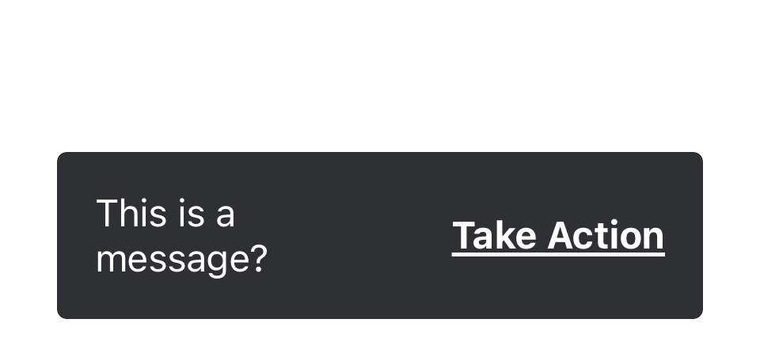

import { graphql } from 'gatsby';
import { ComponentHeader } from 'components/thumbprint-components';

<ComponentHeader data={props.data} />

## Summary

A toast should be used to display a short lived alert at the bottom of the screen with a message, and optionally, a CTA.



## Accessibility

The toast component supports dynamic type by default

## Public API

`public var message: String` The message text to be displayed to the user

`public var linkText: String` The text on the `link` style CTA button

## Usage

Once constructed, a toast can be displayed with animation.

```swift
import Thumbprint

/* ... */

public func display(_ toastWithText text: String, linkText: String, in view: UIView, animate: Bool = true) {
        let toast = Toast(title: text, linkText: linkText)
        view.addSubview(toast)

        var initialYPositionConstraint: Constraint?

        toast.snp.makeConstraints { make in
            make.left.right.equalToSuperview().inset(Space.three)
            initialYPositionConstraint = make.top.equalTo(tabBar.snp.bottom).constraint
        }

        view.layoutIfNeeded()

        initialYPositionConstraint?.deactivate()

        toast.snp.makeConstraints { make in
            make.bottom.equalTo(tabBar.snp.top).offset(-Self.toastSpacing)
        }

        toast.alpha = 0.0

        UIView.animate(withDuration: animate ? 0.5 : 0) {
            toast.alpha = 1.0
            view.layoutIfNeeded()
        }

        DispatchQueue.main.asyncAfter(deadline: .now() + Self.autoDismissDelay) {
            UIView.animate(withDuration: Duration.six, animations: {
                toast.alpha = 0.0
            }, completion: { _ in
                self.remove(toast)
            })
        }
}
```

export const pageQuery = graphql`
    {
        # Get links to by path to display in the navbar.
        platformNav: allSitePage(filter: { path: { glob: "/components/toast/*/" } }) {
            edges {
                node {
                    ...PlatformNavFragment
                }
            }
        }
    }
`;
