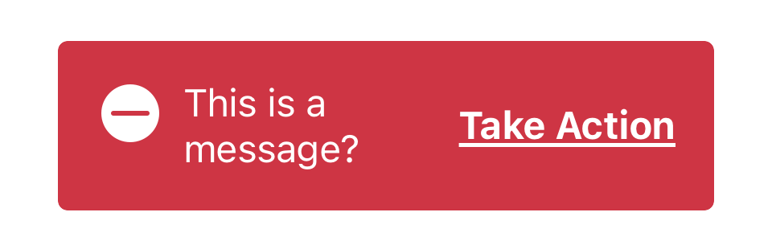
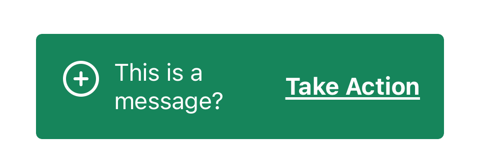

import { graphql } from 'gatsby';
import { ComponentHeader } from 'components/thumbprint-components';

<ComponentHeader data={props.data} />

## Summary

A toast should be used to display a short lived alert at the bottom of the screen with a message, and optionally, a CTA.


## Accessibility

The toast component supports dynamic type by default

## Public API

`public var message: String` The message text to be displayed to the user

`public var action: Toast.Action` The "action" to take on the toast. Includes link text, and a handler closure.

`public var theme: Toast.Theme` A toast theme, which allows for customization of the background color, text color, icon, and icon color.

`public let presentationDuration: TimeInterval` The duration for which to display the toast, defaults to 5 seconds.

## Usage

You can construct a toast with various themes like

```swift
let toast = Toast(message: "This is a message?", theme: Toast.Theme.alert(), action: Toast.Action(text: "Take Action", handler: {
 /* Do some action */
}))
```



You can customize the theme by overriding various properties

```swift
let toast = Toast(message: "This is a message?", theme: Toast.Theme.success(Icon.contentActionsAddMedium), action: Toast.Action(text: "Take Action", handler: {}))
```



Once constructed, a toast can be displayed with animation using the showToast method.

```swift
import Thumbprint

/* ... */

public func display(_ toastWithText text: String, linkText: String, in view: UIView) {
	 let toast = Toast(message: text, action: Toast.Action(text: linkText, handler: {
	  /* Do some action */
	 }))

     toast.showToast(animated: false, completion: nil)
	 view.addSubview(toast)
	 toast.snp.makeConstraints { make in
	      make.leading.trailing.bottom.equalToSuperview()
	 }

}
```

export const pageQuery = graphql`
    {
        # Get links to by path to display in the navbar.
        platformNav: allSitePage(filter: { path: { glob: "/components/toast/*/" } }) {
            edges {
                node {
                    ...PlatformNavFragment
                }
            }
        }
    }
`;
