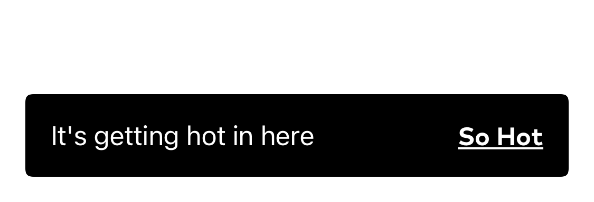
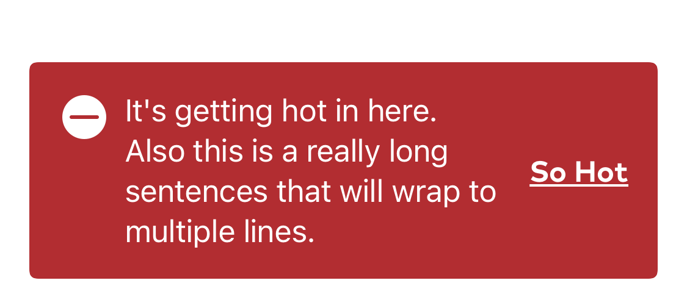

import { graphql } from 'gatsby';
import { ComponentHeader } from 'components/thumbprint-components';

<ComponentHeader data={props.data} />

## Summary

A toast is used to display a short-lived notification and optional CTA at the bottom of the screen.



## Configuration

Toasts support a single left aligned title, a theme, and an optional right aligned link. The toast view is attached to a View with the `.withToast()` modifier. `withToast()` accepts a TPToast binding and an optional `linkAction` closure, which is triggered when the user taps on the link text. When a toast binding exists, it will animated onto the screen, or, if another toast is already showing on screen, it will queue itself for presentation after the existing toast dismisses. The toast automatically dismisses itself after a short period of time (2.5 seconds, by default)

The toast's title, link text, theme, and optional duration are set on the TPToast object itself.

## Usage

The toast binding is attached to a parent view with the `.withToast()` modifier. The visibility of that toast is then controlled by manipulating the binding.

```swift
@State private var toast: TPToast?

public var body: some View {
    VStack {
        TPButton(title: "Make Toast") {
            toast = TPToast(
                title: "Your toast is ready!",
                linkText: "Cancel"
            )
        }
    }
    .withToast($toast) {
        print("Bread ejected")
    }
}
```

## Theming

Toasts can be themed via a TPTheme object that includes a background color, an optional icon, an icon color, and text color.

There are several built in themes. `default`, `alert`, `success`, `info`, `caution`.

```swift

let toast = TPToast(title: someText, theme: .alert, linkText: linkText)

```



export const pageQuery = graphql`
    {
        # Get links to by path to display in the navbar.
        platformNav: allSitePage(filter: { path: { glob: "/components/toast/*/" } }) {
            edges {
                node {
                    ...PlatformNavFragment
                }
            }
        }
    }
`;
