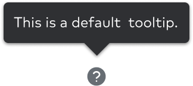
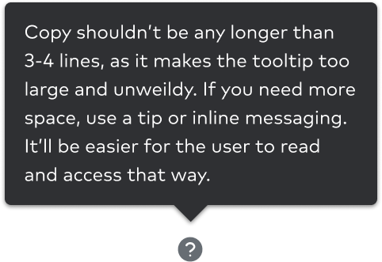

import { graphql } from 'gatsby';
import { ComponentHeader, ComponentFooter } from 'components/thumbprint-components';
import { Img } from 'components/mdx';
import DoDont from 'components/dodont';
import { Grid, GridColumn } from '@thumbtack/thumbprint-react';

<ComponentHeader data={props.data} />

## Default

Tooltips are an informational UI tool that briefly explain the function of a user interface element. They can be triggered when users hover, focus, tap, or click.

The default tooltip has a black container and contains basic information explaining a feature or part of the UI.

### Common features

A tooltip is composed of these basic elements:

-   A trigger (icon, button, link, etc.)
-   A floating tip
-   Static, non-interactive content

A tooltip is summoned or dismissed by:

-   Hovering over an element with a cursor
-   A click or touch
-   Focusing on an element with a keyboard (usually the tab key)

The animation duration is `150ms` easing on entrance and exit.

    

        
    

    

        
    

## Behavior and positioning

Tooltips can be positioned on the top or the bottom of a trigger, and with a slight animation originating from the trigger.

In the event that a tooltip doesn’t have enough space to be centered, it will be automatically positioned using the “best-placement” attribute. It will default on top or bottom and move left/right/down/up depending on the available space.

    

        
    

    

        
    

    

        
    

## Variants

In addition to their positioning, tooltips come in a light and dark theme.

Note: The tooltip theme should be opposite whatever background it is on for maximum readability.

    

        
    

    

        
    

## Content guidelines

-   Tooltip copy be concise and should not exceed 3 lines.
-   Tooltips should be written in sentence case.
-   Tooltips have a max-width of `235px`.
-   Do not include interactive content or images.

<Grid>
    <GridColumn aboveSmall={6}>
        <DoDont type="do">
            

                
            

            

                
            

        </DoDont>
    </GridColumn>
    <GridColumn aboveSmall={6}>
        <DoDont type="dont">
            

                
            

            

                
            

            

                
            

        </DoDont>
    </GridColumn>
</Grid>

<ComponentFooter data={props.data} />

export const pageQuery = graphql`
    {
        # Get links to by path to display in the navbar.
        platformNav: allSitePage(filter: { path: { glob: "/components/tooltip/*/" } }) {
            edges {
                node {
                    ...PlatformNavFragment
                }
            }
        }
    }
`;
