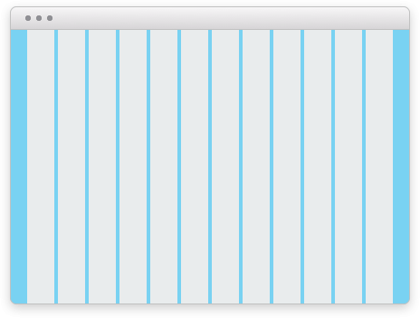

import { graphql } from 'gatsby';
import { ComponentHeader, ComponentFooter } from 'components/thumbprint-components';
import { InlineCode } from 'components/mdx';
import { tpWrapNoPadWidth, tpSpace5, tpSpace3, tpWrapMaxWidth } from '@thumbtack/thumbprint-tokens';

<ComponentHeader data={props.data} />

## Containing content

A wrapper is used at a page or component level to prevent content from becoming too wide. This also centers the content when window exceeds the max-width.

Content that uses the wrapper class will not exceed `946px` wide.

### Default padding

Spacing is built into the wrapper so provide space on the left and right side of the content.

| Browser width                                 | Left and right padding             |
| --------------------------------------------- | ---------------------------------- |
| `0`                                           | <InlineCode children={tpSpace3} /> |
| `480px`                                       | <InlineCode children={tpSpace5} /> |
| `760px`                                       | <InlineCode children={tpSpace5} /> |
| <InlineCode children={tpWrapNoPadWidth} /> \* | `0`                                |

\*At <InlineCode children={tpWrapNoPadWidth} /> the wrapper is <InlineCode children={tpWrapMaxWidth} /> with <InlineCode children={tpSpace5} /> margin on the right and left and the wrapper stops getting wider.

<ComponentFooter data={props.data} />

export const pageQuery = graphql`
    {
        # Get links to by path to display in the navbar.
        platformNav: allSitePage(filter: { path: { glob: "/components/wrap/*/" } }) {
            edges {
                node {
                    ...PlatformNavFragment
                }
            }
        }
    }
`;
