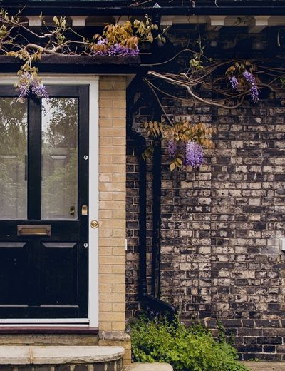
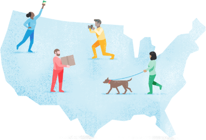

import { List, ListItem } from '@thumbtack/thumbprint-react';

By designing with an existing aspect ratio, teams are able to quickly build UIs using existing classes and components. Though it’s encouraged to use these ratios, some are exempt. For example, marketing and other one-off images can use ratios required by the design.

## 1:1

    

        
Used for:

        <List>
            <ListItem>Avatars for customer and Pros</ListItem>
            <ListItem>Pro Profile thumbnails</ListItem>
            <ListItem>Customer review thumbnails</ListItem>
        </List>
    

    

        

    

    

        
        
Avatar pro

    

    

        
        
Avatar customer

    

    

        
        
Review thumbs

    

    

        
        
Pro profile thumbs

    

## 8:5

    

        
Primarily used for Service Card images.

    

    

        

    

    

## 7:3

    

        
Primarily used for hero images.

    

    

        

    

    

## 16:9

    

        
Primarily used for video embeds.

    

    

        

    

    

## 10:13

    

        
Portrait-sized images.

    

    

        

    

    

## Custom sizes

Custom illustrations and other images, often used for marketing purposes, do not need to fall into one of these aspect ratios.

    

