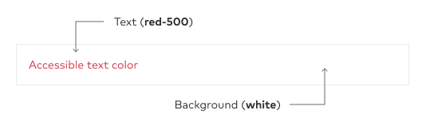

import { ContentActionsCheckTiny } from '@thumbtack/thumbprint-icons';
import { Text, GridColumn, Grid } from '@thumbtack/thumbprint-react';
import DoDont from 'components/dodont';
import {
    tpColorBlue100,
    tpColorBlue200,
    tpColorBlue,
    tpColorBlue600,
    tpColorBlue500,
    tpColorIndigo100,
    tpColorIndigo200,
    tpColorIndigo,
    tpColorIndigo600,
    tpColorIndigo500,
    tpColorPurple100,
    tpColorPurple200,
    tpColorPurple,
    tpColorPurple600,
    tpColorPurple500,
    tpColorGreen100,
    tpColorGreen200,
    tpColorGreen,
    tpColorGreen600,
    tpColorGreen500,
    tpColorYellow100,
    tpColorYellow200,
    tpColorYellow,
    tpColorYellow600,
    tpColorYellow500,
    tpColorRed100,
    tpColorRed200,
    tpColorRed,
    tpColorRed600,
    tpColorRed500,
    tpColorBlack,
    tpColorBlack300,
    tpColorGray,
    tpColorGray300,
    tpColorGray200,
    tpColorWhite,
} from '@thumbtack/thumbprint-tokens';
import { Img, InlineCode } from 'components/mdx';
import Swatch from 'components/thumbprint-guide/swatch';
import SwatchUsage from 'components/thumbprint-guide/swatch-usage';

## Naming

Color names are unambiguous and direct. "Blue" means blue. We do this to avoid unneeded abstractions. Extended color names, like `black-300` are variations that, like font-weight values, denote increasingly darker (500, 600) and increasingly lighter shades (300, 200).

## Palette

-   Our primary palette consists of "core" colors, as indicated by `(c)`, and help establish our brand.
-   We have extended this with shades that are reserved primarily for illustrations.

    <Swatch name="blue-100" hex={tpColorBlue100} />
    <Swatch name="blue-200" hex={tpColorBlue200} />
    <Swatch hasBorder />
    <Swatch name="blue" hex={tpColorBlue} isCore />
    <Swatch name="blue-500" hex={tpColorBlue500} />
    <Swatch name="blue-600" hex={tpColorBlue600} />
    <Swatch name="indigo-100" hex={tpColorIndigo100} />
    <Swatch name="indigo-200" hex={tpColorIndigo200} />
    <Swatch hasBorder />
    <Swatch name="indigo" hex={tpColorIndigo} isCore />
    <Swatch name="indigo-500" hex={tpColorIndigo500} />
    <Swatch name="indigo-600" hex={tpColorIndigo600} />
    <Swatch name="purple-100" hex={tpColorPurple100} />
    <Swatch name="purple-200" hex={tpColorPurple200} />
    <Swatch hasBorder />
    <Swatch name="purple" hex={tpColorPurple} isCore />
    <Swatch name="purple-500" hex={tpColorPurple500} />
    <Swatch name="purple-600" hex={tpColorPurple600} />
    <Swatch name="green-100" hex={tpColorGreen100} />
    <Swatch name="green-200" hex={tpColorGreen200} />
    <Swatch hasBorder />
    <Swatch name="green" hex={tpColorGreen} isCore />
    <Swatch name="green-500" hex={tpColorGreen500} />
    <Swatch name="green-600" hex={tpColorGreen600} />
    <Swatch name="yellow-100" hex={tpColorYellow100} />
    <Swatch name="yellow-200" hex={tpColorYellow200} />
    <Swatch hasBorder />
    <Swatch name="yellow" hex={tpColorYellow} isCore />
    <Swatch name="yellow-500" hex={tpColorYellow500} />
    <Swatch name="yellow-600" hex={tpColorYellow600} />
    <Swatch name="red-100" hex={tpColorRed100} />
    <Swatch name="red-200" hex={tpColorRed200} />
    <Swatch hasBorder />
    <Swatch name="red" hex={tpColorRed} isCore />
    <Swatch name="red-500" hex={tpColorRed500} />
    <Swatch name="red-600" hex={tpColorRed600} />
    <Swatch hasBorder />
    <Swatch hasBorder />
    <Swatch name="black-300" hex={tpColorBlack300} isCore />
    <Swatch name="black" hex={tpColorBlack} isCore />
    <Swatch hasBorder />
    <Swatch hasBorder />
    <Swatch hasBorder />
    <Swatch name="gray-200" hex={tpColorGray200} isCore />
    <Swatch name="gray-300" hex={tpColorGray300} isCore />
    <Swatch name="gray" hex={tpColorGray} isCore />
    <Swatch hasBorder />
    <Swatch hasBorder />
    <Swatch hasBorder />
    <Swatch hasBorder />
    <Swatch hasBorder />
    <Swatch name="white" hex={tpColorWhite} isCore hasBorder />
    <Swatch hasBorder />
    <Swatch hasBorder />

## Usage

<SwatchUsage
    name="Blue"
    hex={tpColorBlue}
    doText="Highlights key actions in UI, buttons, links, icons, and branded moments"
    dontText="Success graphics, body copy, headlines"
/>

<SwatchUsage
    name="Indigo"
    hex={tpColorIndigo}
    doText="Graphs and data visualizations, tags, pills, status labels, illustrations"
    dontText="Text, icons"
/>

<SwatchUsage
    name="Purple"
    hex={tpColorPurple}
    doText="Graphs and data visualizations, tags, pills, status labels, illustrations"
    dontText="Text, icons"
/>

<SwatchUsage
    name="Green"
    hex={tpColorGreen}
    doText="Success graphics, completion, and confirmation"
    dontText="Text, background for white text, graphs and data visualizations, icons"
/>

<SwatchUsage
    name="Yellow"
    hex={tpColorYellow}
    doText="Stars, review charts, alerts, illustrations"
    dontText="Text, background for white text, graphs and data visualizations, icons"
/>

<SwatchUsage
    name="Red"
    hex={tpColorRed}
    doText="Icons, caution buttons, alerts, warning states"
    dontText="Background for white text, icons"
/>

<SwatchUsage
    name="Black"
    hex={tpColorBlack}
    doText="Headings, iconography, and small text that supports UI"
    dontText="Buttons, illustrations"
/>

<SwatchUsage
    name="Black300"
    hex={tpColorBlack300}
    doText="Subheadings and body copy"
    dontText="Logos, icons, backgrounds, borders"
/>

<SwatchUsage
    name="Gray"
    hex={tpColorGray}
    doText="Inactive icons, ghost text"
    dontText="Logos, icons, backgrounds, borders"
/>

<SwatchUsage name="Gray300" hex={tpColorGray300} doText="Borders" dontText="Text, buttons" />

<SwatchUsage
    name="Gray200"
    hex={tpColorGray200}
    doText="Backgrounds behind components, like cards"
    dontText="Text, buttons, borders, icons"
/>

<SwatchUsage
    hasBorder
    name="White"
    hex={tpColorWhite}
    doText="Text, borders, icons"
    dontText="On light backgrounds"
/>

## Accessibility

Accessibility is important for everyone, and it should not forgotten in the design process. Accessible colors are vital for those with color blindness or other vision impairments. By using a high color contrast ratio, you can make sure that your design is accessible to as many people as possible.

Color combinations should be used in accordance with the [WCAG 2.1 AA success criterion for contrast](https://www.w3.org/TR/WCAG21/#contrast-minimum). The color system is set up to provide an accessible experience by combining a particular range of color values from Thumbprint. The combinations include any **100-level** color paired with any **600-level** color values. For example, when using the **blue-100** background color, the **blue-600** color should be used for the text.

### 100-level background

A common and preferred pattern for non-interactive elements when applying a background color uses the 100-level values for backgrounds. The 600-level color of the same hue will ensure an accessible color contrast ratio combined with this background treatment. Any value below the **600-level** (500, 400, 300, 200, 100) **will not** meet the minimum CCR requirement, and the use of these combinations should be avoided.

#### Examples

### White background

The foreground text should use the **500 value** when using a **white** background. This combination ensures that the color contrast ratio meets the 4.5:1 minimum. Any value below the **500-level** (400, 300, 200, 100) **will not** meet the minimum CCR requirement, and the use of these combinations should be avoided.

#### Examples

### Neutral colors

The foreground text should use the **500 value** when using a **white** background. This combination ensures that the color contrast ratio meets the 4.5:1 minimum. Any value below the **500-level** (400, 300, 200, 100) **will not** meet the minimum CCR requirement, and the use of these combinations should be avoided.

#### Examples

### Avoid using color exclusively

Colors can also be used to convey information. For example, using red for error messages or green for success messages can help users understand your interface more quickly. Ultimately, accessible colors can help create a better experience for all users, regardless of their abilities.

However, color alone should not be used exclusively as an indicator for a user experience. To provide a more inclusive experience, additional information, such as supportive text, should be included.

## Implementations

-   All color variables shown here available for SCSS and JS usage in [Thumbprint Tokens](/tokens/#section-color).
-   The "core" colors, as indicated by `(c)`, are available as classes in [Thumbprint Atomic](/atomic/#section-color) for both `color` and `background` properties.

## Resources

-   [WCAG 2.1 AA success criterion for contrast](https://www.w3.org/TR/WCAG21/#contrast-minimum).
