import { Img } from 'components/mdx';
import { Text } from '@thumbtack/thumbprint-react';

Forms are used to gather content from users. They are designed to encourage and assist users in thoughtfully completing the form to the best of their ability. This requires decisions about structure, sequence, interface element placement, and feedback in the form of errors and prompts.

### Structure

Our standard forms have a single column layout. Avoiding multi-column layout improves a user’s likelihood to complete all inputs. This leads to fewer submission errors, increasing valid form submission.

In the event that content should be grouped, rows can be divided into columns (typically up to 4). Examples where grouping content proves to be more effective:

-   First name, last name
-   Credit card data (number, expiry, ccv)
-   Time data (day, month, year, time)

    

        

            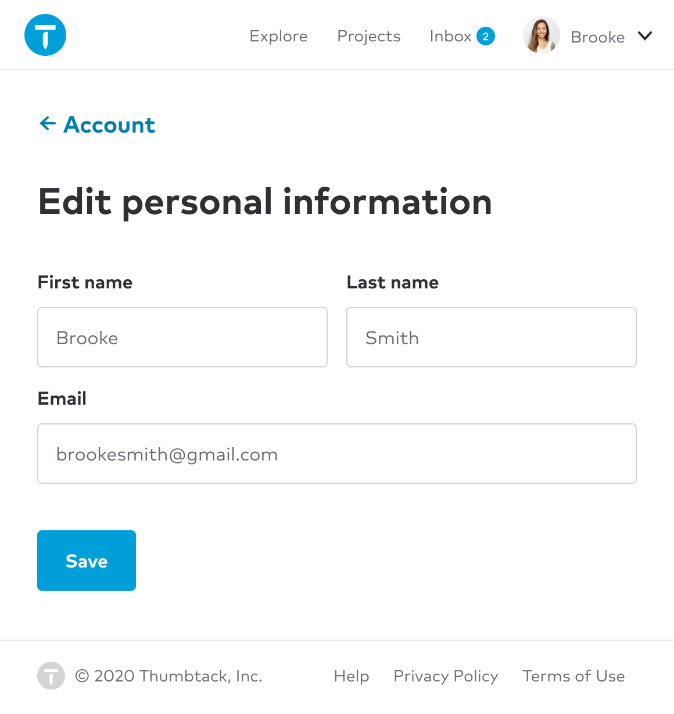
        

        <Text size={2} className="b mt2">
            Single page form with grouped inputs
        </Text>
    

    

        

            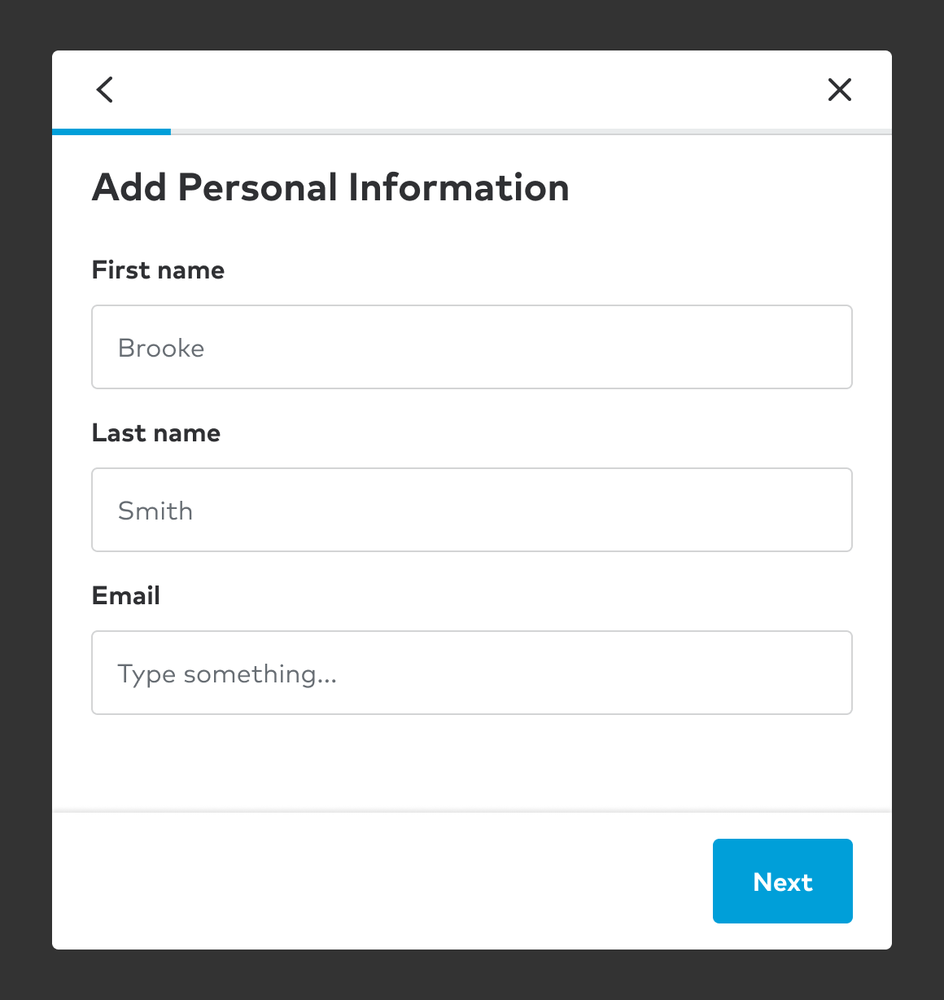
        

        <Text size={2} className="b mt2">
            Modal form with single row inputs
        </Text>
    

###### Note on Jakob’s Law:

Users prefer your site to work the same way as all the other sites they already know.

### Sequence

Standard forms are front-loaded with more easily accessible content (e.g. Name appears first). The thinking here is to leverage the sunk-cost fallacy - once a user is some percentage complete they become more likely to complete the task.

#### Grouping

When a design requires a large amount of data or many disparate types of data be collected, it is best to group them into sections. In Thumbprint we see this most commonly in large forms being presented in a multi-step modal. But this is equally valuable for single-page forms as well.

###### Note on Miller’s Law:

The average person can only keep 7 (plus or minus 2) items in their working memory.

### Interface elements

We intend to standardize usage and placement of interface elements as much as possible. There are some best practices we can try to follow.

#### Labels

Labels are always presented left-aligned, above corresponding inputs and groups of inputs. This is a convention that – supported by research – improves scannability for all users, but is especially beneficial to vision impaired users.

#### Controls

Checkboxes, Dropdowns, Radios, and Switches are all capable of collecting effectively the same data and can generally be used interchangeably. There are some best practices you can follow to make choosing the right controls simpler.

##### Checkboxes

Inclusive multiple choice – a user can select all or none of the presented options. You can also make selecting at least one required. Typically you will want to present these as a list grouped under a single label.

    

        

            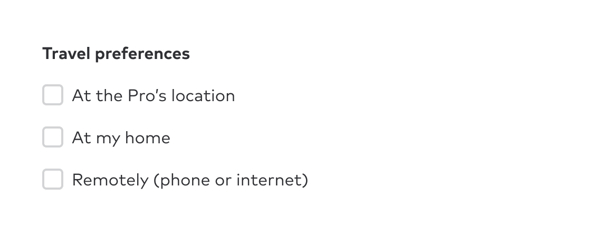
        

        <Text size={2} className="b mt2">
            Checkboxes in a single page form
        </Text>
    

    

        

            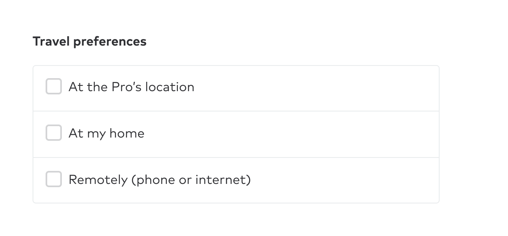
        

        <Text size={2} className="b mt2">
            Checkboxes in a modal form
        </Text>
    

##### Dropdowns

Mutually exclusive choices between enumerated options. Use if there are greater than 6 options in most cases.

    

        

            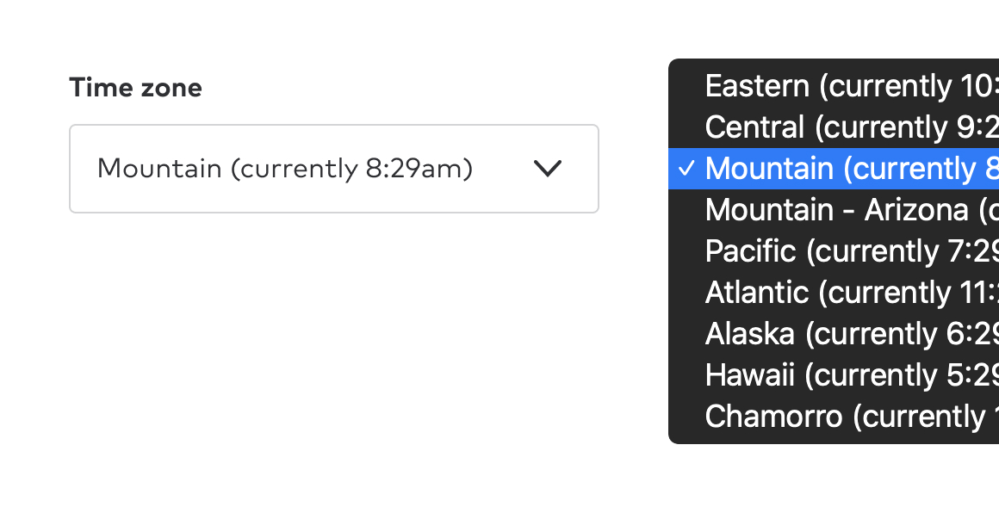
        

        <Text size={2} className="b mt2">
            We use the system options by default
        </Text>
    

##### Radios

Mutually exclusive choices between enumerated options. Use if there are fewer than 7 options in most cases.

    

        

            
        

        <Text size={2} className="b mt2">
            Radios in a single page form
        </Text>
    

    

        

            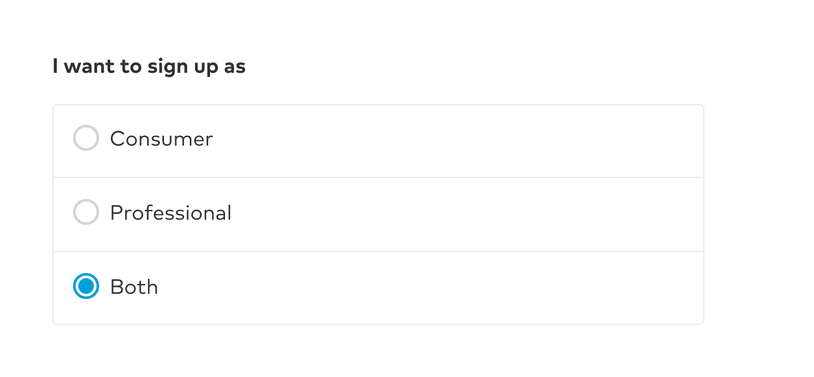
        

        <Text size={2} className="b mt2">
            Radios in a modal form
        </Text>
    

##### Switches

Mutually exclusive at the most granular level; a yes/no or on/off decision. Use for yes/no or on/off input.

    

        

            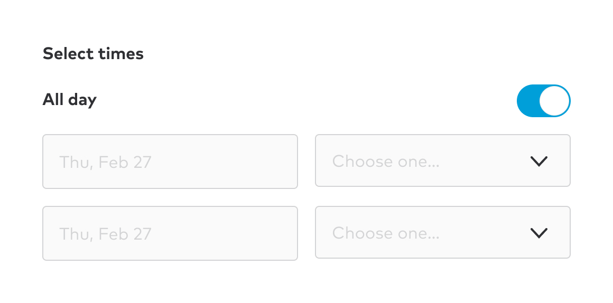
        

        <Text size={2} className="b mt2">
            Switches always use this default style
        </Text>
    

#### Grouping controls

Checkboxes and Radios are both typically grouped under a single label.

##### Single page forms

Related inputs can be grouped with a fieldset.

##### Modals

Related inputs are grouped by adding a step to the modal.

#### Help

Offering supporting text to clarify a label or explain what is expected for a specific form input is important in many cases.

#### Form notes

These notes align to the bottom of a text input that is determined to need obvious support text. It sits 8px below the text input and provides additional context for the content expected to be supplied by the user.

    

        

            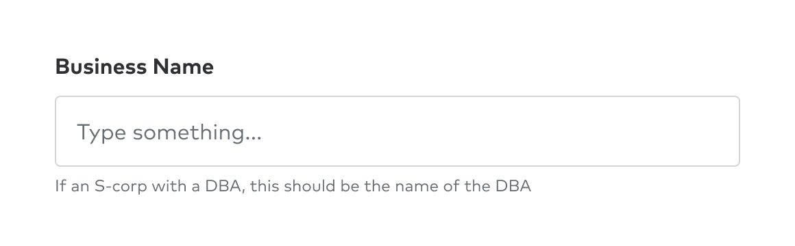
        

        <Text size={2} className="b mt2">
            Supporting text provides context
        </Text>
    

#### Tooltips

When content needs context that is longer than a single sentence or can be illustrated more clearly for desktop users, tooltips provide the content.

    

        

            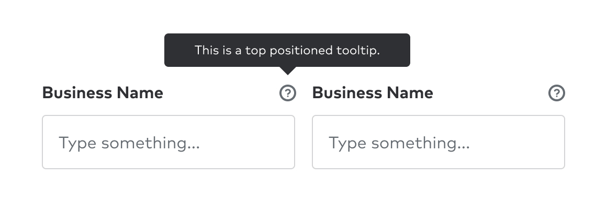
        

        <Text size={2} className="b mt2">
            When a label is necessarily obscure
        </Text>
    

#### Optional fields

Identifying required fields will help ensure users complete the required data, but it results in a lot of extra content in the form in the event that most of the content is required. This typically pushes designers to omit an indicator for required fields.

A solution to this is to mark only optional fields. This does two things, it improves the visual presentation of the form and incentivizes designers to flag any content that is optional.

    

        

            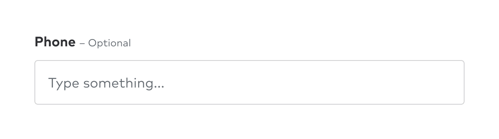
        

        <Text size={2} className="b mt2">
            Optional callout is body text
        </Text>
    

#### Text Inputs

##### Disabled

Try to avoid using disabled inputs - they are typically an accessibility trap, but they also don’t provide much value to the user. If they are pre-filled with correct data, they can typically be omitted in favor of improved copy stating what we already know.

##### Use common input names

This one should go without saying, but if the content is a standard input across the web we should be including the correct name for saved browser defaults to auto-fill. This saves users time and makes them feel cared for.

#### Buttons

##### Placement

Buttons used to submit a single-page form should be left-aligned in concert with the labels of the form. This addresses an accessibility concern – when a window is zoomed, aligning the labels and the CTA enables a zoomed user to more easily find and use the submit button.

Buttons used to link to an additional step of a user flow, used to trigger an event, or buttons that are sticky to the bottom of the viewport should be right-aligned or full-width.

    

        

            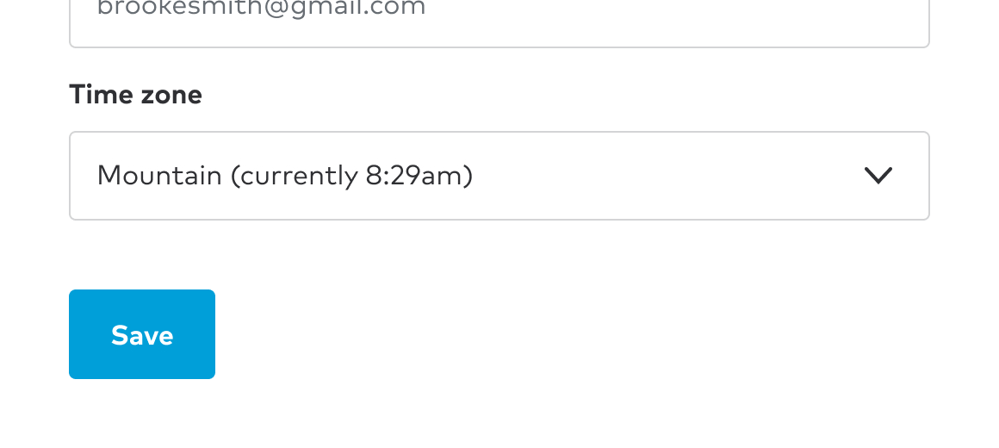
        

        <Text size={2} className="b mt2">
            Left placement on single page form
        </Text>
    

    

        

            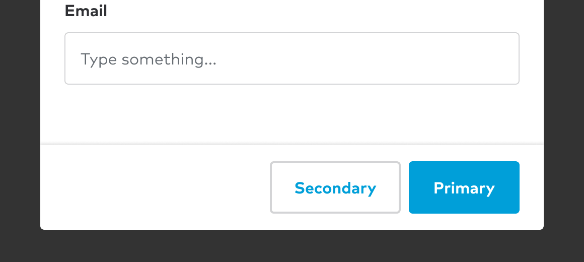
        

        <Text size={2} className="b mt2">
            Right placement denotes a flow
        </Text>
    

### Feedback

Users will inevitably make mistakes while entering their content. To help here we support them with messaging and prompts that enable them to correct the data prior to submission.

#### Error messaging

When an error occurs we can identify the specific form element that is in error on submission. This can be a mis-typed email address or an unfilled, required field.

#### Inline validation

Errors should be presented inline, utilizing the form note and the input error state. Ideally this occurs after focus is removed from the field itself, not on submission of the form.

    

        

            
        

        <Text size={2} className="b mt2">
            Errors are always inline
        </Text>
    

