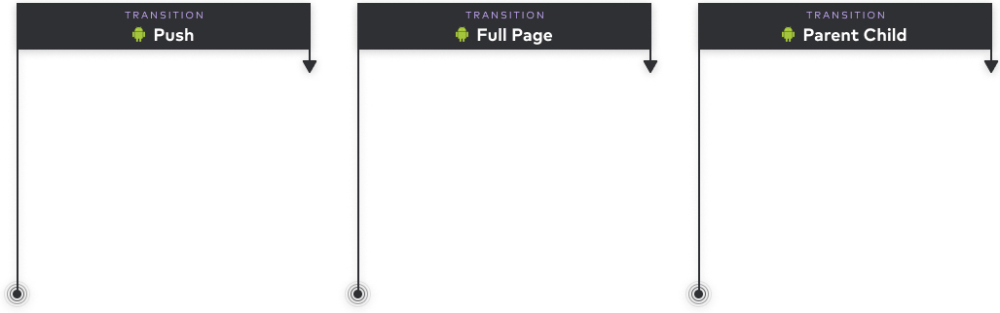

import Banner from 'components/motion/general/banner';
import Scale from 'components/motion/general/scale';
import Skip from 'components/motion/general/skip';

import Easing from 'components/motion/general/easing';
import Color from 'components/motion/general/color';
import Pop from 'components/motion/general/pop';
import Slide from 'components/motion/general/slide';

import Push from 'components/motion/page/push';
import IosPageSheet from 'components/motion/page/ios/page-sheet';
import IosFullScreenModal from 'components/motion/page/ios/full-screen-modal';
import AndroidFullPage from 'components/motion/page/android/full-page';
import AndroidParentChild from 'components/motion/page/android/parent-child';

import { Img, InlineCode } from 'components/mdx';
import { Title, Text, Grid, GridColumn, HorizontalRule } from '@thumbtack/thumbprint-react';

Motion can introduce elements of delight and activity for users. Used sparingly, it can focus their attention and help them navigate through the UI. Here we discuss motion generally, the specific page-level navigations available on iOS and Android, and custom animations.

## General motion

### Principles

Deciding what type of animation to use is more art than science. They should be quick but not jarring. To achieve this balance we generally use short durations for animations with smaller items and those moving smaller distances. Larger objects and objects moving larger distances will use longer durations.

### Easing

For those familiar with easing values on the web these are slightly more aggressive than a browser’s `animation-timing-function` defaults.

[Easing tokens](/tokens/scss/#section-easing) are available for use in SCSS and Javascript. iOS and Android should use their platform’s built-in easings.

    

        
ease-in

        <Text size={2}>
            <InlineCode theme="plain">cubic-bezier(0.50, 0, 1, 1)</InlineCode>
        </Text>
        <Text size={2} className="black-300">
            Moves from slow to fast.
        </Text>
    

    

        

            <Easing animation="easeIn" />
        

    

    

        
ease-out

        <Text size={2}>
            <InlineCode theme="plain">cubic-bezier(0, 0, 0.40, 1)</InlineCode>
        </Text>
        <Text size={2} className="black-300">
            Moves from fast to slow.
        </Text>
    

    

        

            <Easing animation="easeOut" />
        

    

    

        
ease-in-out

        <Text size={2}>
            <InlineCode theme="plain">cubic-bezier(0.45, 0, 0.40, 1)</InlineCode>
        </Text>
        <Text size={2} className="black-300">
            Moves slowly on both ends.
        </Text>
    

    

        

            <Easing animation="easeInOut" />
        

    

### Duration

Determines the length of the animation. The length of the animation usually corresponds to the size and distance of the animation.

[Duration tokens](/tokens/scss/#section-duration) are available for all platforms.

<table>
    <thead>
        <tr>
            <th>
                <Text size={2}>Token</Text>
            </th>
            <th>
                <Text size={2}>Duration</Text>
            </th>
        </tr>
    </thead>
    <tbody>
        <tr>
            <td>
                <Text size={2}>
                    <InlineCode theme="plain">duration-1</InlineCode>
                </Text>
            </td>
            <td>
                <Text size={2}>
                    <InlineCode theme="plain">75ms</InlineCode>
                </Text>
            </td>
        </tr>
        <tr>
            <td>
                <Text size={2}>
                    <InlineCode theme="plain">duration-2</InlineCode>
                </Text>
            </td>
            <td>
                <Text size={2}>
                    <InlineCode theme="plain">150ms</InlineCode>
                </Text>
            </td>
        </tr>
        <tr>
            <td>
                <Text size={2}>
                    <InlineCode theme="plain">duration-3</InlineCode>
                </Text>
            </td>
            <td>
                <Text size={2}>
                    <InlineCode theme="plain">200ms</InlineCode>
                </Text>
            </td>
        </tr>
        <tr>
            <td>
                <Text size={2}>
                    <InlineCode theme="plain">duration-4</InlineCode>
                </Text>
            </td>
            <td>
                <Text size={2}>
                    <InlineCode theme="plain">250ms</InlineCode>
                </Text>
            </td>
        </tr>
        <tr>
            <td>
                <Text size={2}>
                    <InlineCode theme="plain">duration-5</InlineCode>
                </Text>
            </td>
            <td>
                <Text size={2}>
                    <InlineCode theme="plain">300ms</InlineCode>
                </Text>
            </td>
        </tr>
        <tr>
            <td>
                <Text size={2}>
                    <InlineCode theme="plain">duration-6</InlineCode>
                </Text>
            </td>
            <td>
                <Text size={2}>
                    <InlineCode theme="plain">350ms</InlineCode>
                </Text>
            </td>
        </tr>
    </tbody>
</table>

### Examples

These first three are generic examples of motion. Click each to toggle the animation.

    

        

            <Color />
        

        <Text size={2} className="mt2 b">
            Color transition
        </Text>
        <Text size={2}>
            <InlineCode theme="plain">duration-3</InlineCode> with{' '}
            <InlineCode theme="plain">ease-in</InlineCode>
        </Text>
    

    

        

            <Pop />
        

        <Text size={2} className="mt2 b">
            Pop-up
        </Text>
        <Text size={2}>
            <InlineCode theme="plain">duration-2</InlineCode> with{' '}
            <InlineCode theme="plain">ease-out</InlineCode>
        </Text>
    

    

        

            <Slide />
        

        <Text size={2} className="mt2 b">
            Slide
        </Text>
        <Text size={2}>
            <InlineCode theme="plain">duration-5</InlineCode> with{' '}
            <InlineCode theme="plain">ease-out</InlineCode>
        </Text>
    

And these three examples are based on interactions currently used in Thumbtack products.

    

        

            <Banner />
        

        <Text size={2} className="mt2 b">
            Banner slide down/up
        </Text>
        <Text size={2}>
            <InlineCode theme="plain">duration-3</InlineCode> with{' '}
            <InlineCode theme="plain">ease-in</InlineCode>
        </Text>
    

    

        

            <Scale />
        

        <Text size={2} className="mt2 b">
            Hover/touch scale
        </Text>
        <Text size={2}>
            <InlineCode theme="plain">duration-2</InlineCode> with{' '}
            <InlineCode theme="plain">ease-out</InlineCode>
        </Text>
    

    

        

            <Skip />
        

        <Text size={2} className="mt2 b">
            Skip fade out/in
        </Text>
        <Text size={2}>
            <InlineCode theme="plain">duration-4</InlineCode> with{' '}
            <InlineCode theme="plain">ease-out</InlineCode>
        </Text>
    

    <HorizontalRule />

## Page-level transitions

iOS and Android each ship with a number of stock page-level transitions. In this guide we’ll define which transitions are available on each platform, when each should be used, what’s involved in building custom transitions, and how transitions should be communicated by designers to developers in their layouts.

### Examples

Click on any of the letters to toggle the animations. Note that the transition speeds used in these examples has been slowed to better convey how the transition works.

#### iOS

    

        <Push />
        
Push

        <Text size={2} className="black-300">
            “Pushes” a page out of the way for the other, sliding in from the right to go deeper
            into the UI.
        </Text>
    

    

        <IosPageSheet />
        
Page sheet

        <Text size={2} className="black-300">
            A page slides from bottom and stacks above parent page.
        </Text>
    

    

        <IosFullScreenModal />
        
Full screen modal

        <Text size={2} className="black-300">
            Page slides from bottom, overtakes entire screen.
        </Text>
    

#### Android

    

        <Push />
        
Push

        <Text size={2} className="black-300">
            “Pushes” a page out of the way for the other, sliding in from the right to go deeper
            into the UI.
        </Text>
    

    

        <AndroidFullPage />
        
Full page

        <Text size={2} className="black-300">
            Page overtakes unrelated existing page with slight grow.
        </Text>
    

    

        <AndroidParentChild />
        
Parent child

        <Text size={2} className="black-300">
            Transition from a child expanding to full screen.
        </Text>
    

### Building custom native transitions

#### Stick with stock

We generally recommend using the stock animations that are pre-packaged on the different platforms. The primary reason for this is consistency.

Users get accustomed to page-level interactions. They become conventions. Introducing a new way for the user to interact, or changing existing ones, can be disorienting and confusing, particularly when a standard transition will do.

Also, these interactions are changed occasionally in OS releases. If we bypass the stock animations our users will not benefit from these updates, again distancing them from the convention.

#### Custom

    

        

            A custom transition can be built into a feature or flow if it uniquely improves the user
            experience as they pass through it.
        

        

            For example, as of late 2019, the iOS App Store home used a custom navigation that
            pushes the article out and over the link. Instead of an overlay sliding from the right
            or bottom the user has the sense of moving deeper into the UI, experiencing the
            hierarchy in a less jarring way.
        

        

            Custom transitions like these should be vetted with prototypes, user testing, and native
            developers who will determine the technical feasibility of building and maintaining it.
        

    

    

        
    

## Communicating motion in Figma

The inability to communicate motion in static layouts has been a long-standing problem in the design world. In the absence of this information it is often up to the native developer to decide how to implement it.

To alleviate this problem with page-level transitions we recommend designers to use the motion annotations we’ve provided in Figma.

<Text size={2} className="black-300 mb3 b">
    Example transition annotations available in Figma.
</Text>

