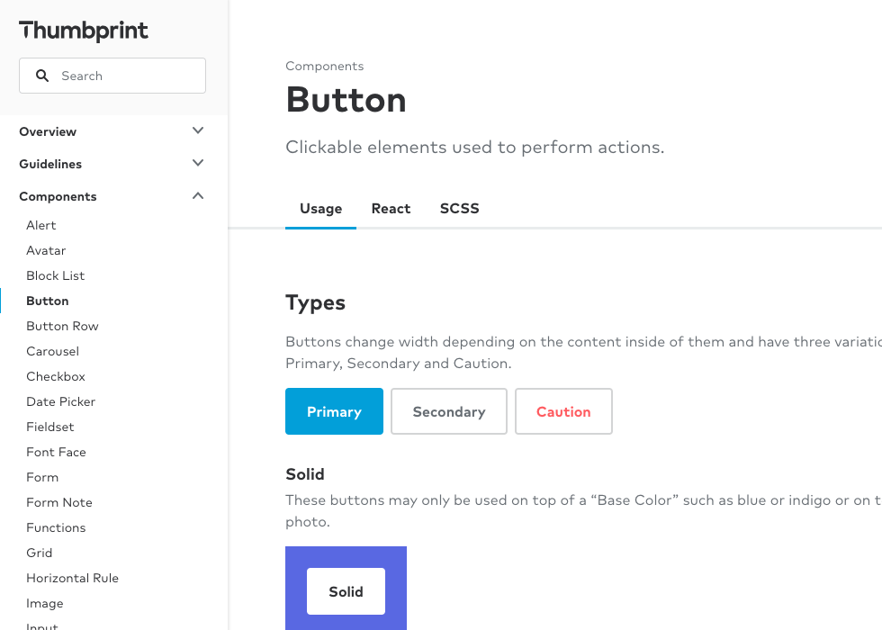

import { Title, Text, GridColumn, Grid } from '@thumbtack/thumbprint-react';
import { Img, P } from 'components/mdx';

At Thumbtack toolkits are the primary output of Design Systems team.

-   Each toolkit focuses on a single concept and to be considered complete must pass through four phases.
-   The scope of the toolkits can be broad and foundational, like color and type, or narrowly focused on specific components, like notifications and progress bars.
-   Work on the toolkits is prioritized through a combination of team requests and the judgment of the Design System team.

## Toolkit phases

<Grid gutter="wide">
    <GridColumn aboveSmall={6}>
        

            
        

        <Title size={5} headingLevel={3} className="mb1">
            1. Design
        </Title>
        

            In the first phase a designer audits and consolidates existing examples found in our
            products, researches best practices, considers feedback from designers, writers and
            engineers, and creates the user interface specifications and usage guidelines.
        

    </GridColumn>
    <GridColumn aboveSmall={6}>
        

            
        

        <Title size={5} headingLevel={3} className="mb1">
            2. Build
        </Title>
        

            A Design Systems engineer creates the required code in phase two. This usually includes
            Sass, HTML, and React but may also necessitate new infrastructure. For example, our icon
            system required a build system to support multiple platforms.
        

    </GridColumn>
    <GridColumn aboveSmall={6}>
        

            
        

        <Title size={5} headingLevel={3} className="mb1">
            3. Documentation
        </Title>
        

            Once the toolkit is built, product teams need to know how to use it. This phase
            documents the specifications and usage guidelines for designers and writers along with
            the API instructions for engineers.
        

    </GridColumn>
    <GridColumn aboveSmall={6}>
        

            
        

        <Title size={5} headingLevel={3} className="mb1">
            4. Release
        </Title>
        

            In the final phase the Design Systems team announces that the toolkit is available. This
            means all pattern and API documentation from previous phases is published online and any
            code is versioned and released.
        

    </GridColumn>
</Grid>
