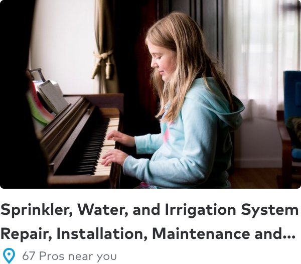
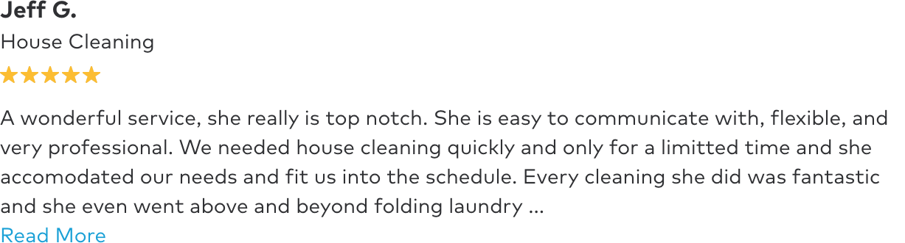
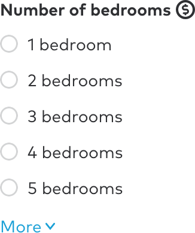

Though truncation should be used infrequently there are situations where the user can benefit from seeing a preview of data. For example, a user may want to skim through the beginning of multiple reviews before deciding to view one in its entirety.

## Types

In Thumbtack products there are four types of truncation in use:

1. Strings that are one line long with no UI action to expand the truncated text.
2. Strings between two and three lines long with no UI action to expand the truncated text.
3. Long blocks of text, like user reviews, that can be expanded with a "Read more" link.
4. Lists of items that are extended with a "Show more" link.

## Patterns & implementations

### 1. Single-line strings

<div className="ba b-gray-300 pa4">
    <div className="truncate">
        In our industry, you hear a lot of talk about the future of work. What I’ve come to believe
        — because I see it every day — is that the entrepreneurial spirit of independent
        professionals is the most precious resource we have as a society.
    </div>
</div>

#### Web

In this case a few lines of well-supported CSS is sufficient. The `truncate` class is available in our [Atomic library](/atomic/#section-truncate) to make this easy.

```css
.truncate {
    white-space: nowrap;
    overflow: hidden;
    text-overflow: ellipsis;
}
```

### 2. Multiline strings

<div class="ba b-gray-300 pa4">
    
</div>

#### Web

This type of truncation is more complicated with no one perfect solution. There are a number of Sass and JavaScript approaches but they are often convoluted and limited. In this case we recommend a Sass approach that uses `line-height` tokens to calculate a `max-height`.

```scss
.multiline {
    font-size: $tp-font__title__3__size; // Needed for IE 11
    line-height: $tp-font__title__3__line-height; // Needed for IE 11
    max-height: $tp-font__title__3__line-height * 2; // Needed for IE 11
    overflow: hidden;
    display: -webkit-box;
    -webkit-line-clamp: 2;
    -webkit-box-orient: vertical;
}
```

-   Most users will see an ellipsis if the text overflows the number of lines specified in `-webkit-line-clamp`.
-   Non-supporting browsers, like IE 11, will see no ellipsis and the text will cut off at the last word that fits.

### 3. "Read more"

<div class="ba b-gray-300 pa4 mb3">
    
</div>

Because the Sass pattern for multiline truncation described above relies on a `max-height` calculation, it can visually break if the size of the text container changes unexpectedly. To insulate against this we recommend the following:

-   Truncate the string using a word count.
-   If the word count threshold is met, append an ellipsis to the string.
-   The “Read more” link should be on its own line below.
-   A “Read less” button to undo the reveal action is not needed.

Note that this approach means that the truncation will often not occur at the end of a line.

### 4. "Show more"

<div class="ba b-gray-300 pa4 mb3">
    
</div>

This is a standard Javascript interaction to show/hide multiple elements in a list. The number of elements to hide and reveal should be at the discretion of the designer and developer, keeping in the mind the following:

-   Include logic to avoid hiding only one element.
-   Consider whether the user should be able to show and re-hide the content.
