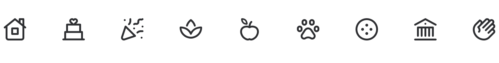

import { ThemedLink } from '@thumbtack/thumbprint-react';
import { ContentModifierLockedSmall } from '@thumbtack/thumbprint-icons';
import { Img } from 'components/mdx';

## Icon library

For legal reasons we require authentication to download Thumbprint icons. If you’re not already logged into Okta you’ll be asked to enter your credentials before you proceed.

<ThemedLink to="https://icons.thumbprint.design/" icon={<ContentModifierLockedSmall />}>
    Open Thumbprint Icons
</ThemedLink>
