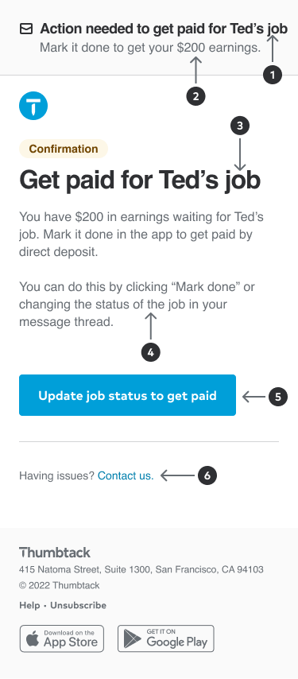
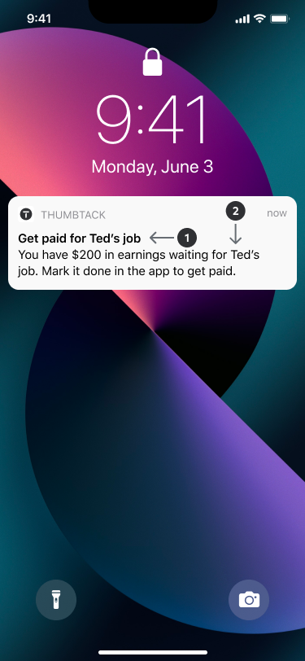

import DoDont, { DoDontTable } from 'components/dodont';
import Wrap from 'components/wrap';
import { Img } from 'components/mdx';
import { Anatomy, AnatomyItem } from 'components/anatomy';
import { Grid, GridColumn } from '@thumbtack/thumbprint-react';

## Emails

Keep emails short, ideally less than 150 words. To emphasize a point, use a single sentence paragraph. Otherwise, each paragraph should cover one topic in no more than four lines (about 50 words). Lean on subheaders and bulleted lists to structure complex or [lengthy information](/overview/content-design/grammar-and-mechanics#section-write-using-plain-language).

<Anatomy>
    <AnatomyItem number="1" title="Subject lines (SL)">
        <Text size={2} className="black-300">
            Keep subject lines under 10 words or 40 characters and don’t punctuate them. They should
            communicate the most important information, like a deadline or required action.
        </Text>
    </AnatomyItem>
    <AnatomyItem number="2" title="Pre-headers (PH)">
        <Text size={2} className="black-300">
            This is the sentence that appears next to or near the subject line in an email inbox.
            It’s often clipped, so keep it under 10 words or 40 characters as well. Write it as a
            complete sentence with punctuation that reinforces the subject line, continues the
            conversation, or entices action.
        </Text>
    </AnatomyItem>
    <AnatomyItem number="3" title="Headers">
        <Text size={2} className="black-300">
            Not all emails need headers, but they can be a helpful way to highlight and frontload
            the main message. Headers often repeat or expand upon the subject line. Ideally, headers
            are contained to one line.
        </Text>
    </AnatomyItem>
    <AnatomyItem number="4" title="Body">
        <Text size={2} className="black-300">
            Keep body copy concise and use formatting, like subheaders or bulleted lists, to improve
            readability. Paragraphs should cover one topic and not exceed three lines.
        </Text>
    </AnatomyItem>
    <AnatomyItem number="5" title="Calls to action (CTAs)">
        <Text size={2} className="black-300">
            Always include at least one call to action, even if it’s just to go to the app. To test
            for readability, ask if the main message of the email can be understood by reading the
            subject line, header, and CTA alone.
        </Text>
    </AnatomyItem>
    <AnatomyItem number="6" title="Footers">
        <Text size={2} className="black-300">
            Optionally, you can add a secondary CTA, like linking to the Help Center, in the footer.
            Always include the standard footer with our business address, a link to unsubscribe, and
            links to download the app.
        </Text>
    </AnatomyItem>
</Anatomy>

## Push and SMS notifications

Push and SMS notifications are an effective way to communicate time-sensitive, actionable messages — especially to pros who are on the job. Assume you’re writing for a smaller phone screen with a standard font display setting and keep content under 90 characters.

To avoid inundating users with communications, waterfall the push and SMS instead of sending both. In other words, send a push notification first and, if the user has push notifications turned off, send an SMS.

<Anatomy>
    <AnatomyItem number="1" title="Headers">
        <Text size={2} className="black-300">
            Fit headers to one line and use them to communicate the main message. Emojis that are
            associated with specific features (like the lightning bolt for Instant Book) can help
            communicate context in fewer characters, but don’t rely on them alone.
        </Text>
    </AnatomyItem>
    <AnatomyItem number="2" title="Body">
        <Text size={2} className="black-300">
            Body copy should be no more than three lines. Make sure that it indicates where the user
            will navigate if they click through the notification.
        </Text>
    </AnatomyItem>
</Anatomy>

## Calls to action

Buttons and links should always be sentence case, unless they contain a proper noun. Buttons should be 4 words or less and links should be 8 words or less.

When writing copy for buttons and links, remember these 4 guidelines from [Nielsen Norman Group](https://www.nngroup.com/articles/better-link-labels/):

-   Specific: begin with strong, actionable verbs and avoid self-evident ones (like “Click”)
-   Sincere: accurately describe where the user will go once it’s clicked
-   Substantial: make it unique and clear to be understood without surrounding context
-   Succinct: get to the point and cut unnecessary words like articles or adjectives

Use buttons for primary actions and links for navigation. Unless you’re following a common button pattern, like “Done” or “Continue,” buttons and links should follow the [action verb] + [noun] pattern.

Remember, image-only buttons and links need alt-text.

export const dd_cta = [
    ['See policy details', 'Learn more'],
    ['Start free trial', 'Try it now!'],
    ['Set reminder', 'Set a reminder'],
];

<DoDontTable examples={dd_cta} />

## Error messages

When writing error messages, explain what went wrong and how to fix it. Avoid generic language and focus on getting the user back on track (rather than explaining what happened).

Encountering an error isn’t fun no matter the severity, so approach tone with this in mind. Don’t make jokes to try to put the user at ease and use passive voice when helpful to avoid sounding accusatory. When it’s our fault, take responsibility and emphasize how we’re making it right.

### Headers

Keep headers to one line and no more than 10 words. Generally, headers communicate what went wrong. If a user only reads the header and CTA, they should have all the information needed to resolve the error.

### Body

Use complete sentences and keep body copy to two lines total. This space is generally used to provide additional context on the reason for the error — avoid technical jargon (e.g. “Error 404”) and focus only on the information that helps the user resolve it.

### CTA

Keep CTAs to four words or less and don’t punctuate them. If the user can resolve the error on their own, direct them to do so in the CTA (even if it’s just trying again or refreshing the page).

export const dd_error_messages = [
    ['We weren’t able to process your payment.', 'The payment failed.'],
    ['We’re working to improve.', 'We’re sorry.'],
    ['That doesn’t look like the right password.', 'You entered the wrong password'],
];

<DoDontTable examples={dd_error_messages} />
